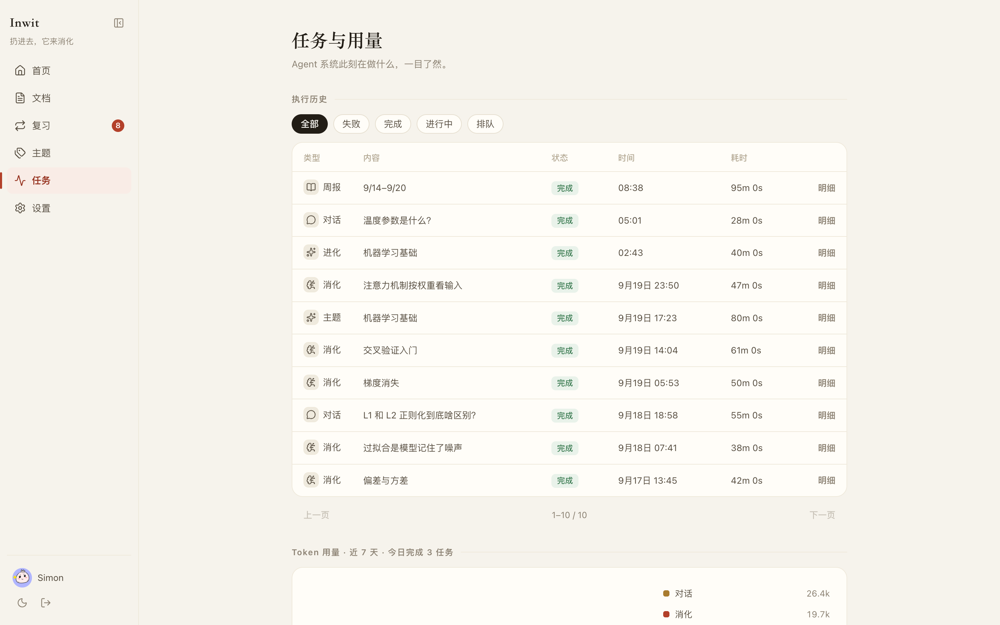
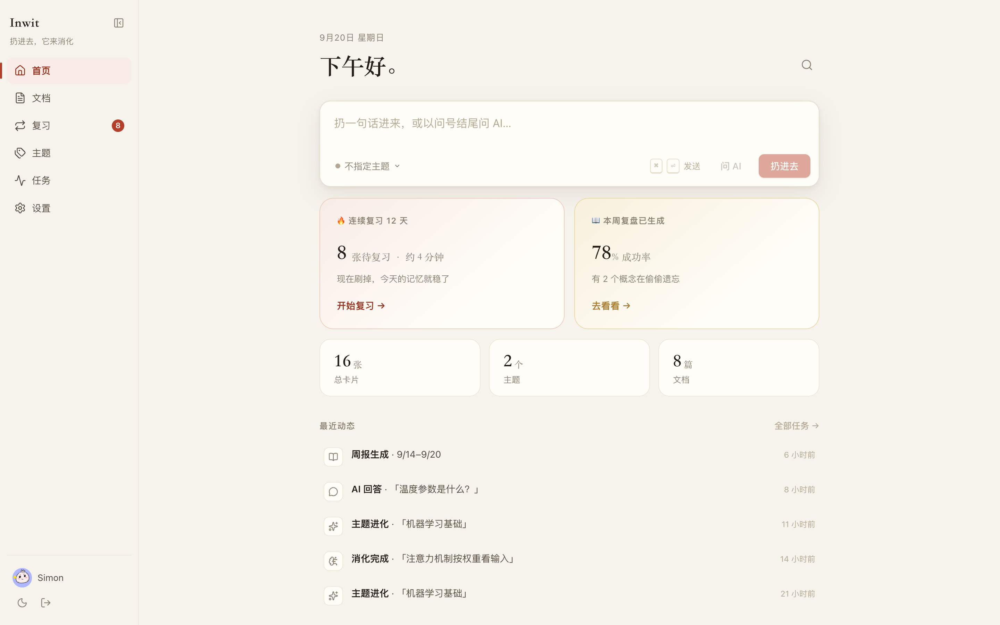
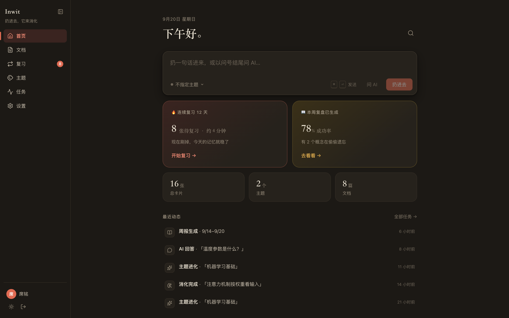
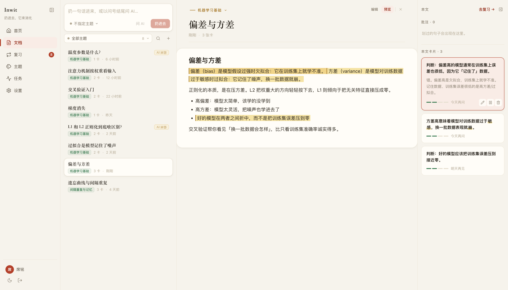
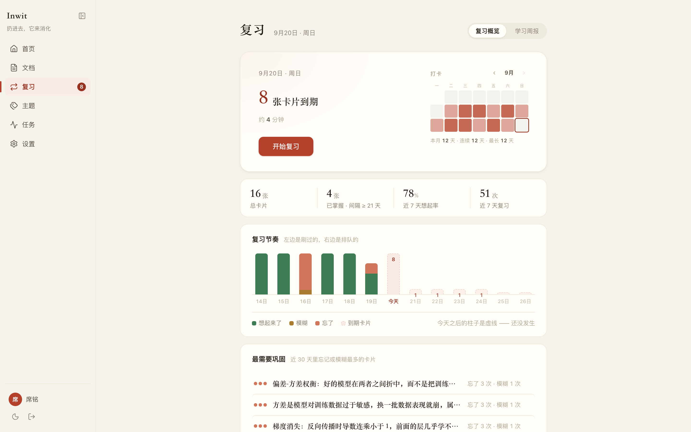
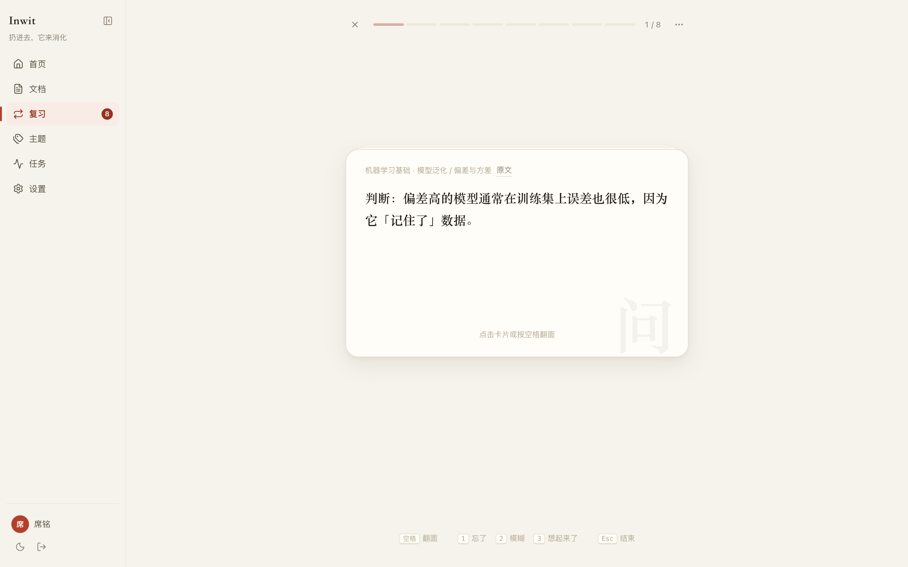
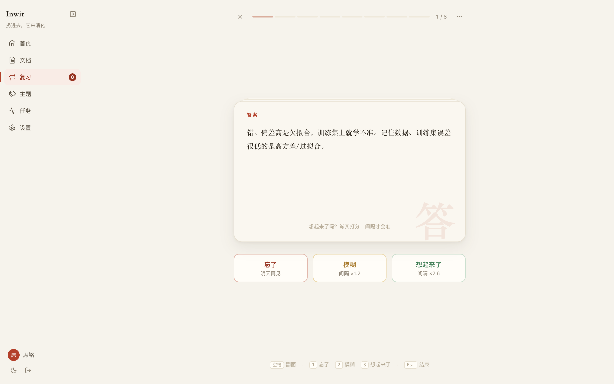
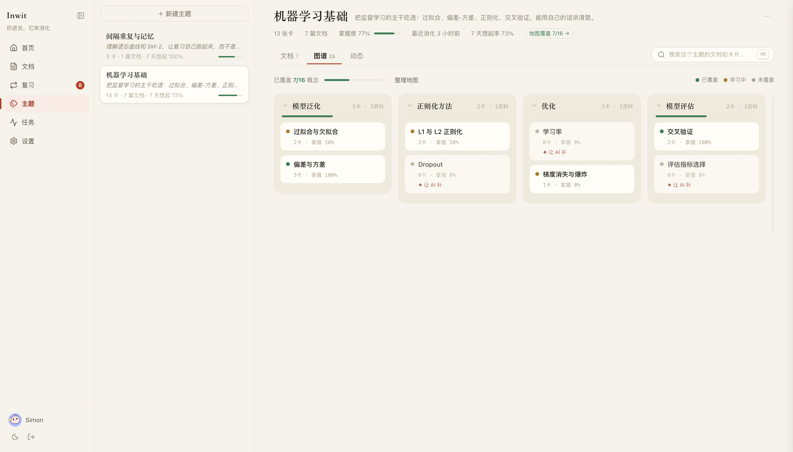
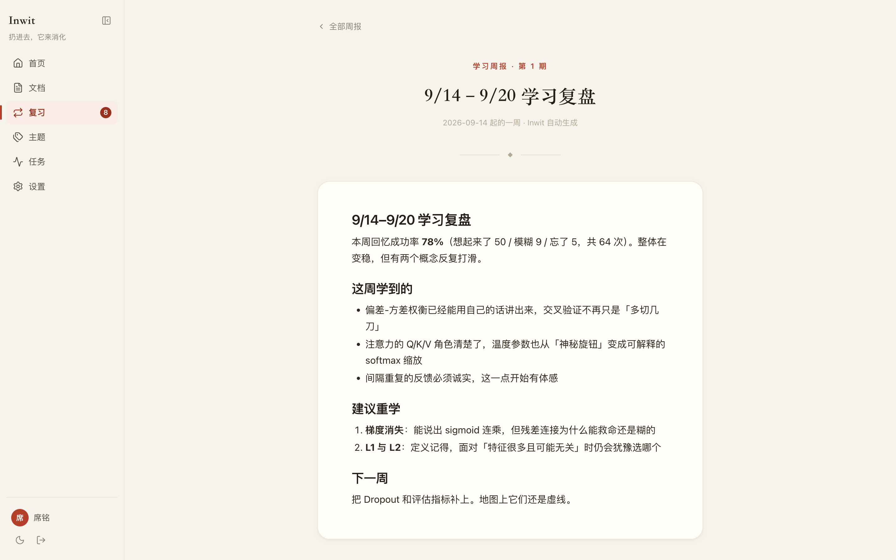
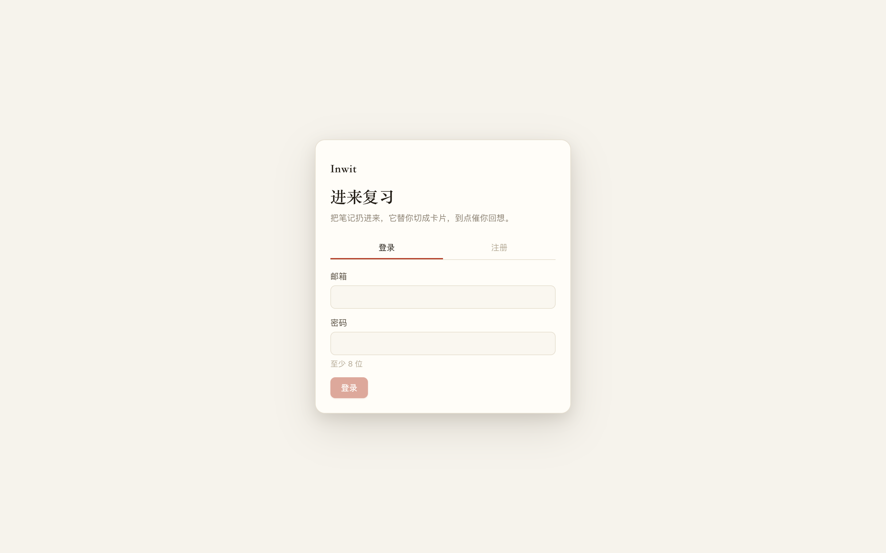

<p align="center">
  
</p>

<h1 align="center">Inwit</h1>

<p align="center"><strong>只管往里扔。它替你消化，并催你复习。</strong></p>

<p align="center">
  <strong>AI First</strong> 的学习伴侣：收集（资料）→ 消化（卡片）→ 复盘（复习）。<br />
  你负责扔进去；Agent 负责切卡、出题、排每日队列、维护知识地图。
</p>

<p align="center">
  <a href="https://inwit.aimo.plus">inwit.aimo.plus</a>
  ·
  <a href="#产品理念">理念</a>
  ·
  <a href="#agent--ai-first-的两条路径">AI First</a>
  ·
  <a href="#快速开始">快速开始</a>
  ·
  <a href="#编码-agent">编码 Agent</a>
  ·
  <a href="#架构">架构</a>
  ·
  <a href="#贡献">贡献</a>
</p>

<p align="center">
  = 22" src="https://img.shields.io/badge/Node.js-%3E%3D22-5FA04E?logo=nodedotjs&logoColor=white" />
  
  
  
</p>

---

## 产品理念

Inwit 是 **AI First**，同时追求 **纸上学习**。打开后先看到今天该回忆什么，而不是文件夹和标签；Agent 在后台切卡、出题、画地图，提议开题要你点头才落地。

学习收成四个动作，不多不少：**输入 → 消化 → 记住 → 贯通**。

- **一个闭环，而不是一堆工具。** 笔记、问号、截图先丢进资料；消化 Agent 切成原子卡片并出题；复习按遗忘曲线推到今天的队列；三档反馈再驱动换讲法、拆卡和周报。编码 Agent 也可以当投喂口，但不另起一套笔记。
- **你只做输入。** 不要求分类、打标签、选文件夹。主题不是文件夹，是 Agent 替你维护的知识地图；空白节点可以让 AI 补一张入门卡。
- **回忆必须是你自己的。** 切卡和出题可以交给模型；翻面之前先想，三档反馈才写进 SM-2。偷看作对，下次只会隔得更远。
- **基础层不依赖 AI。** 卡片 + 间隔重复在没有模型时也能跑。AI 只做增强：换讲法、拆小、对比专题、周报。密钥按需配置（BYOK），用量在任务页可见。

视觉主题为 **纸上学习**：宣纸底、暖墨字、朱批红。浅色是白日书桌，深色是灯下夜读。规范见 [docs/design-system.md](docs/design-system.md)。

## 它不是什么

| | 他们在做的 | Inwit 在做的 |
|---|---|---|
| Notion / Obsidian | 打开驱动，手动整理 | 输入驱动，Agent 整理 |
| Anki | 手动制卡，机械重复 | AI 制卡，推送驱动的复习闭环 |
| 聊天机器人 | 回答完就散 | 回答落成卡片，进入复习队列 |
| 编码 Agent 自己记笔记 | 再做一个第二大脑 | 只负责投喂，消化和复习仍在 Inwit |

主题不是文件夹。资料按时间流入主题或未归属池；Agent 维护一张概念大纲树。空白节点可以让 AI 补——这是复习之外的第二个学习驱动。

## Agent · AI First 的两条路径

Inwit 把 Agent 当成产品的一部分，而不是外挂聊天窗。

1. **对内**：worker 里的后台 Agent 消化资料、回答问题、整理地图、根据复习反馈进化，并按周写复盘。
2. **对外**：仓库里的 [skills/inwit](skills/inwit/SKILL.md) 让其他 Agent 用个人访问令牌调用同一套 HTTP API。

<p align="center">
  
  
</p>

### 对内：Agent 怎么工作

配置好模型（设置 → 模型配置，用户 BYOK；系统可走百炼兜底）之后，独立 worker 轮询 `jobs` 表。状态不在进程内存里：领取、超时回收、失败重试都落在 PostgreSQL，进程重启也能接着跑。所有查询按 `userId` 隔离。没有 worker，文档会停在「消化中…」。

| 能力 | 做什么 | 何时跑 |
|---|---|---|
| 消化 `digest` | 把长内容切成原子卡片（概念 + 例子 + 易混点），出题，挂到知识地图 | 资料入库后入队 |
| 问答 `chat` | 直接提问，中文回答落成文档，并自动转卡片 | 以问号结尾发送 |
| 主题 `topic` | 整理 / 补全知识地图，未归属资料聚成一类时提议开题 | 用户点「整理地图」，或后台建议 |
| 进化 `evolve` | 反复忘的换讲法、拆小、出混淆对比 | 复习反馈触发 |
| 周报 `weekly_report` | 回忆成功率、建议重学的概念 | 按周自动入队 |
| 提取 / 识别 `extract` `ocr` | 从原件抽文本，识别扫描页 | 导入 PDF 等 |

切卡会直接写入，开题要你点头。三档反馈（忘了 / 模糊 / 想起来了）才改间隔。任务页能看见 Agent 在跑什么、失败了什么、用了多少 token。

<p align="center">
  
</p>

### 对外：Skill 让其他 Agent 接入

仓库自带可安装的 skill：[skills/inwit/SKILL.md](skills/inwit/SKILL.md)。Claude、Codex、Cursor 或其他能跑 skill 的 Agent 都可以用它操作你的 Inwit，而不必再做一个第二大脑。

1. 在 **设置 → 接口令牌** 签发 `iwt_` 前缀的个人访问令牌（明文只显示一次，可随时撤销）。
2. 按下面的 [编码 Agent](#编码-agent) 把 skill 装到对应工具，并设置 `INWIT_TOKEN` / `INWIT_BASE_URL`。
3. 接口目录按域拆开（[skills/inwit/references/](skills/inwit/references/)），Agent 只加载当前意图的那一个模块，不要靠记忆编字段，也不要手搓文档 JSON。

外部 Agent **只负责投喂和读取**：把笔记、问号送进来，看今天的队列。消化、SM-2、知识地图仍在服务端跑。

Skill 里写好的典型工作流：

- **投喂笔记**：`POST /api/open/documents`（markdown 或 html）。
- **提问并制卡**：`POST /api/chat`，问题以 `？` / `?` 结尾。
- **今日复习**：`GET /api/review/today`，反馈 `POST /api/review/:cardId/feedback`。
- **主题 / 地图**：见 topics 模块。
- **任务进度**：`GET /api/jobs/queue`。

对内 Agent 和对外 skill 操作的是同一份数据：你在网页里扔的，Claude 看得到；Claude 投喂的笔记，首页和文档列表立刻出现。

---

## 产品长什么样

首页是一张纸。上面是捕捉，下面是今天该回忆的数量、本周复盘，以及最近 Agent 在忙什么。

<p align="center">
  
</p>

<p align="center"><sub>浅色 · 白日书桌。深色是灯下夜读，同一套纸感。</sub></p>

<p align="center">
  
</p>

文档工作台把阅读、编辑和卡片放在同一个窗格。Agent 切出的原子卡挂在原文锚点上，侧栏可以直接翻看、暂停或改写。

<p align="center">
  
</p>

复习中心给今日队列、打卡热图和近七日节奏。点进去是翻卡：先自己想，再翻面，三档反馈决定下次出现的时间。

<p align="center">
  
</p>

<p align="center">
  
  
</p>

主题是一门课的方向。地图由 Agent 维护：已覆盖、学习中、尚未碰到的概念一眼能看见。虚线节点可以让 AI 补。

<p align="center">
  
</p>

每周会自动写一份复盘：成功率、反复打滑的概念、下一周该补哪块。

<p align="center">
  
</p>

---

## 概念模型

四个实体，对应四个动作：

| 实体 | 动作 | 说明 |
|---|---|---|
| **资料**（Document） | 输入 | 课件、草稿、剪藏、截图、AI 回答。全部是文档 |
| **卡片**（Card） | 消化 | 原子知识：一条概念 + 一个例子 + 一个易混点，带出处锚点 |
| **主题**（Topic） | 贯通的方向 | 你给自己开的一门课：有目标、有资料、有卡片、有知识地图 |
| **关联**（Link） | 贯通的结构 | 卡片↔卡片、卡片↔资料（锚点）、资料/卡片↔主题（归属） |

复习不是实体，是卡片上的 SM-2 状态。未归属的资料可以由消化 Agent 软归属，用户只有确认权，没有整理义务。

---

## 架构

服务端优先。Web / 桌面 / 移动共用同一套 API 与 DTO。

```
┌─────────────────────────────────────────────────────────┐
│  客户端                                                  │
│  Web (Vite + React 19 + @rabjs/react)                   │
│  桌面 (Tauri 2，系统截图 / OCR)                           │
│  移动 (Expo / React Native)                              │
├─────────────────────────────────────────────────────────┤
│  服务端  Fastify 5 + drizzle-orm                         │
│  认证 · BYOK 模型 · 文档 inbox · 复习队列 · 任务与用量     │
├─────────────────────────────────────────────────────────┤
│  Agent 层（全部收敛于 pi-agent-core，不在体系外直调 LLM）  │
│  消化  扫描 inbox → 切卡 → 出题 → 挂地图                   │
│  问答  直接提问 → 中文回答 → 自动转卡片                    │
│  主题  整理知识地图 / 补空白 / 提议开题                    │
│  进化  换讲法 / 拆卡 / 混淆对比 / 周报复盘                 │
│  LLM   @earendil-works/pi-ai，用户 BYOK + 系统兜底        │
├─────────────────────────────────────────────────────────┤
│  数据                                                    │
│  PostgreSQL   业务数据 + 任务队列                         │
│  Qdrant       向量召回（2560 维）                         │
│  Meilisearch  中文稀疏召回                                │
│  百炼         embedding + rerank                         │
│  S3           附件（客户端只拿预签名 URL，不持有密钥）      │
└─────────────────────────────────────────────────────────┘
```

检索是混合召回：Qdrant 语义 + Meili 关键词 → RRF 融合 → rerank。所有查询按 `userId` 隔离。

Agent 跑在独立 worker 进程里。没有 worker，文档会停在「消化中…」。

### 仓库结构

pnpm monorepo，全 ESM（相对导入带 `.js` 后缀，tsconfig 为 NodeNext）。

```
inwit/
├── apps/server       Fastify + drizzle + worker（:3020）
├── apps/web          Vite + React + @rabjs/react（:5190，/api 代理到 3020）
├── apps/desktop      Tauri 2 桌面壳
├── apps/mobile       Expo / React Native
├── packages/dto      前后端共享 zod schema（API 契约的唯一来源）
├── packages/doc-schema / doc-engine / markdown
├── packages/brand    App 图标源（改 logo.svg 后 raster-icons）
├── skills/inwit      给外部编码 Agent 的 skill（HTTP 投喂 / 复习）
└── docs/             PRD、设计稿、任务与开发日志
```

改 API：先改 `packages/dto`，再同步 server 的 parse/service 和 web 的调用方。

---

## 快速开始

需要 **Node 22+** 和 **pnpm 10**。数据库与检索的连接写在 `apps/server/.env`（不入库）。

```bash
pnpm install
pnpm --filter @inwit/server migrate
pnpm dev                                 # server :3020 + web :5190
pnpm --filter @inwit/server worker        # 另开一个终端：消化 / 问答 / 进化 / 周报
```

浏览器打开 [http://localhost:5190](http://localhost:5190)。

<p align="center">
  
</p>

### 桌面端

需要 Rust 与系统 WebView：

```bash
pnpm --filter @inwit/desktop dev          # 等 Vite :5190，连本地 API :3020
```

macOS 点红灯会藏到菜单栏，并不退出；「退出 Inwit」才退出。全局快捷键 ⌘⇧2 / Ctrl+Shift+2 区域截图（macOS 需「屏幕录制」权限）。

### 生产与安装包

生产桌面包把 `VITE_TAURI_API_URL` 打进前端；Android APK 把 `EXPO_PUBLIC_API_BASE_URL`（以及 Expo `extra.apiBaseUrl`）打进客户端。由仓库变量 / workflow 输入 `INWIT_API_URL` 注入，默认 `https://inwit.aimo.plus`。

GitHub Release 打 `v*.*.*` tag 后，Actions「Build Desktop and Android」会把 macOS / Windows / Linux 安装包和 Android APK 挂到该 Release。Server 镜像推 `ghcr.io/ximing/inwit-server`（同一镜像 `node dist/worker.js` 跑 worker）。

```bash
docker compose -f docker-compose.prod.yml run --rm migrate
docker compose -f docker-compose.prod.yml up -d
```

生产 compose 需 `.env`，见 [`.env.production.example`](.env.production.example)。

---

## 编码 Agent

Inwit 在 [`skills/`](skills) 下内置 [Agent Skills](https://code.claude.com/docs/en/claude-code/skills)，教编程 Agent 通过 HTTP API 操作同一份数据。技能本体是纯 `SKILL.md`（外加按域拆开的 `references/`），同一份文件适用于各编程工具。安装方式因工具而异——多个工具同时使用时，需要分别为每个工具安装。理念与工作流见 [Agent · AI First 的两条路径](#agent--ai-first-的两条路径)。

插件清单的布局与 [CSI](https://github.com/ximing/csi) 相同（`.claude-plugin` / `.codex-plugin` / `.cursor-plugin` 等）。装过一个再装另一个，各自装一次。

先在 Inwit **设置 → 接口令牌** 创建令牌（前缀 `iwt_`），写入环境变量，不要贴进对话或仓库：

```bash
export INWIT_TOKEN='iwt_…'
export INWIT_BASE_URL='https://inwit.aimo.plus'   # 本地可省略，默认 http://localhost:3020
```

### Claude Code

```bash
/plugin marketplace add ximing/inwit
/plugin install inwit@inwit
```

或：`cp -r skills/inwit ~/.claude/skills/`

### Codex App / Codex CLI

本仓库同时是 Codex plugin marketplace（[`.agents/plugins/marketplace.json`](.agents/plugins/marketplace.json)）：

```bash
codex plugin marketplace add ximing/inwit
codex plugin add inwit@inwit
```

### Cursor

清单在 [`.cursor-plugin/plugin.json`](.cursor-plugin/plugin.json)。在 Cursor Agent 对话里执行 `/add-plugin inwit`，或把 `skills/inwit` 拷进项目的 `.cursor/skills/`。

### Grok Build CLI

```bash
cp -r skills/inwit ~/.grok/skills/
```

若正在本仓库里工作，也可把 skill 放到当前项目能扫到的 skills 目录。调用：`/inwit`。

### Kimi Code

```text
/plugins install https://github.com/ximing/inwit
```

然后 `/new` 开一个新会话，让插件加载。

### OpenCode

在 `opencode.json`（全局或项目）里注册 `skills/`：

```json
{
  "plugin": ["inwit@git+https://github.com/ximing/inwit.git"]
}
```

### Pi

```bash
pi install git:github.com/ximing/inwit
```

根目录 [`package.json`](package.json) 的 `pi.skills` 指向 `./skills`。

装好后对 Agent 说「投喂这段笔记到 Inwit」或「今日复习」即可。约定与模块索引见 [`skills/inwit/SKILL.md`](skills/inwit/SKILL.md)。接口目录按模块拆在 `skills/inwit/references/`，Agent 只应打开当前意图对应的那一个 md。

---

## 页面路由

| 路径 | 页面 |
|---|---|
| `/` | 首页（Today）：今日复习、捕捉、连续天数 |
| `/login` | 登录 / 注册 |
| `/docs` | 文档工作台（`?doc=` 打开，`&edit=1` 编辑，`&anchor=` 滚到卡片锚点） |
| `/review` | 复习中心（Hub + SM-2 设置 + 翻卡；`?tab=reports` 为周报） |
| `/topics` | 学习主题 |
| `/topics?topic=:id` | 主题详情（知识地图 + 资料流） |
| `/jobs` | 任务与用量 |
| `/settings` | 外观、BYOK 模型、接口令牌 |

旧路径由前端跳到新地址，书签不用改：`/doc/:id` → `/docs?doc=`，`/editor/:id` → `&edit=1`，`/card/:id` → `/review`，`/admin` → `/jobs`。

---

## 常用命令

```bash
pnpm -r typecheck
pnpm -r build
pnpm --filter @inwit/server test
pnpm --filter @inwit/server test -- src/review/sm2.test.ts
pnpm --filter @inwit/server migrate:generate   # schema 变更后生成
pnpm --filter @inwit/server migrate            # 执行
pnpm --filter @inwit/desktop test              # Tauri 合同测试
pnpm --filter @inwit/brand raster-icons
```

改 `apps/server/src/db/schema.ts` 必须走 drizzle migration，不手改数据库。

发版前先升级 `apps/web/package.json` 的 `version`（semver）。Vite 构建时打进前端常量，设置页底部展示；不要在 UI 里手写版本号。

---

## 环境变量

写在 `apps/server/.env`。`config.ts` 用 zod 校验，缺项会拒绝启动。测试环境只读 `apps/server/.env.test`，不回落开发 `.env`。

| 变量 | 说明 |
|---|---|
| `NODE_ENV` | `development` / `test` / `production` |
| `PORT` | HTTP 端口，默认 `3020` |
| `WEB_ORIGIN` | CORS 与 cookie 用的前端源，默认 `http://localhost:5190` |
| `PG_HOST` `PG_PORT` `PG_USER` `PG_PASSWORD` `PG_DATABASE` `PG_SSL` | PostgreSQL |
| `JWT_SECRET` / `COOKIE_SECRET` | 至少 32 字符 |
| `LLM_KEY_ENCRYPTION_KEY` | 32 字节 hex，加密用户 BYOK key |
| `QDRANT_URL` `QDRANT_API_KEY` | 向量库 |
| `MEILI_HOST` `MEILI_API_KEY` | 中文稀疏检索 |
| `DASHSCOPE_API_KEY` | 百炼：系统兜底 chat、embedding、rerank |
| `EMBEDDING_MODEL` / `EMBEDDING_DIMENSIONS` | 默认 `qwen3-vl-embedding` / `2560` |
| `RERANK_MODEL` | 默认 `qwen3.7-text-rerank` |
| `WORKER_POLL_MS` `WORKER_CLAIM_LIMIT` `WORKER_STUCK_MS` `JOB_MAX_ATTEMPTS` | 队列 |

附件走远端 S3，服务端签发预签名 URL；客户端不持有存储密钥，DB 只存对象 key。需要的变量见 `ATTACHMENT_S3_*`（`.env.production.example` 有完整清单）。Bucket CORS 需允许前端来源的 GET、PUT、HEAD，并暴露 `ETag`。

---

## 贡献

欢迎 issue 和 pull request。较大的行为变更，请先开 issue 对齐，再动手。

1. Fork，从 `master` 拉功能分支。
2. `pnpm install` 后按「快速开始」把 web + server + worker 跑起来。
3. 提交前至少：

   ```bash
   pnpm typecheck
   pnpm --filter @inwit/server test
   pnpm --filter @inwit/web build
   ```

约定（完整版在仓库根目录 [`CLAUDE.md`](CLAUDE.md)）：

- **API 契约只出在 `@inwit/dto`**。先改 zod schema，再改 server / web。
- **Schema 变更走 drizzle**（`schema.ts` → `migrate:generate` → `migrate`）。
- **Agent 可测逻辑放 `*-logic.ts`**，编排和 IO 放旁边的模块；后端测试不连真实数据库。
- **前端一页一个 Service**（`@rabjs/react`），不要另引状态库。文案中文，语气克制书面。不要用 `window.alert` / `prompt` / `confirm`，走全局 DialogService。
- **样式按功能就近**：页面 CSS 放 `apps/web/src/pages/<功能>/`，不要往全局 `styles.css` 堆业务规则。新 CSS 必须在 `style-entry.css` 登记。
- **图片与文件**只走服务端预签名 URL。

UI 视觉以 [`docs/design/v2/`](docs/design/v2/) 为设计稿。产品需求见 [`docs/prd.md`](docs/prd.md)。

---

## 文档

| 文档 | 内容 |
|---|---|
| [docs/prd.md](docs/prd.md) | 产品需求与概念模型 |
| [docs/design-system.md](docs/design-system.md) | 「纸上学习」设计系统 |
| [docs/design/v2/](docs/design/v2/) | UI 重构设计稿 |
| [skills/inwit/SKILL.md](skills/inwit/SKILL.md) | 给外部编码 Agent：HTTP 投喂与复习 |
| [CLAUDE.md](CLAUDE.md) | 给在本仓库里改代码的代理 |
| [docs/dev-log.md](docs/dev-log.md) | 开发日志 |
| [docs/tasks/](docs/tasks/) | 历史任务与报告 |

---

## 许可证

源码目前公开在 GitHub，**尚未选择 SPDX 许可证**。个人学习、阅读和提 PR 欢迎；二次分发或商用请先开 issue 与维护者沟通。
