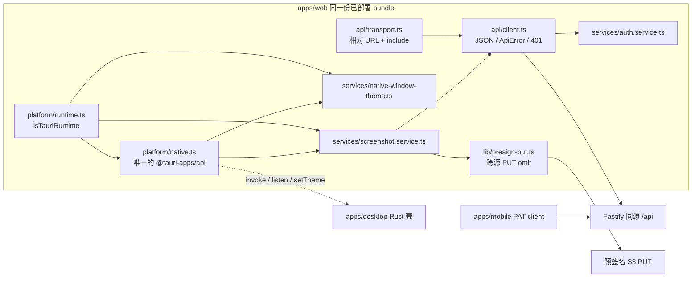
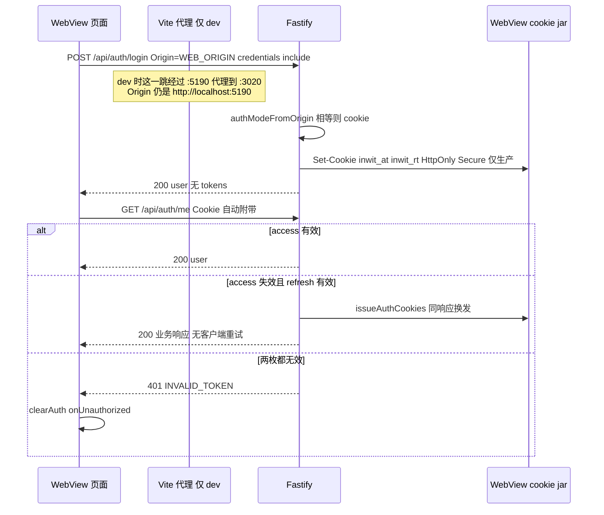
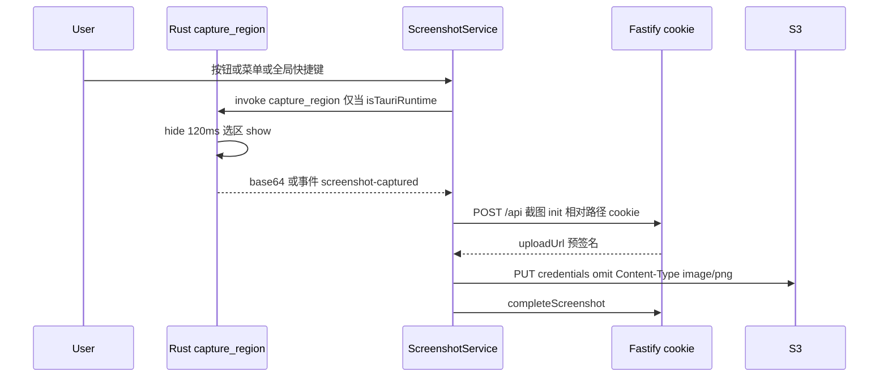
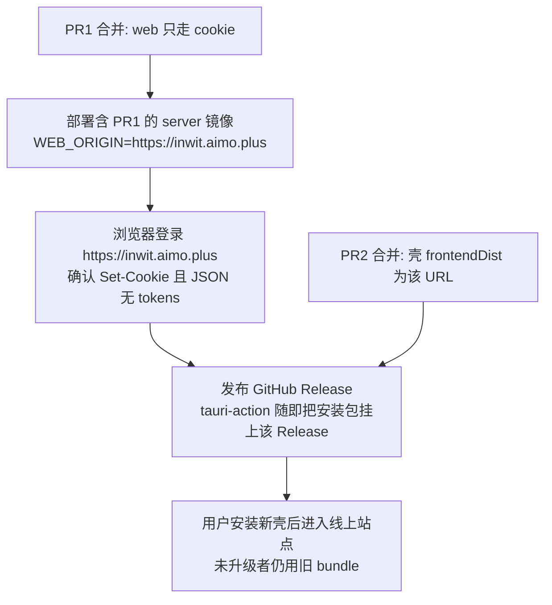

# 桌面壳加载远程生产站点

| 项 | 值 |
|---|---|
| 状态 | Draft |
| 作者 | 待定 |
| 日期 | 2026-09-24 |
| 仓库 | `ximing/inwit`，默认分支 `master` |
| 范围 | Tauri 2 桌面壳如何加载远程 web，以及 `@inwit/web` 里浏览器 / 桌面原生 / 移动端的代码边界 |

## Overview

生产桌面壳今天在安装包里再塞一份 `apps/web/dist`。这份包的文档源是 `http://tauri.localhost`（或 `https://tauri.localhost`），不等于服务器的 `WEB_ORIGIN`，所以 Fastify 不会给它发 cookie 会话。WebView 里的 `fetch` 打到 API 还会撞上 CORS。于是 `apps/web/src/api/tauri.ts` 同时承担了运行时检测、`plugin-http`、`plugin-store`、Bearer 刷新和 cookie 内存令牌。生产 web 构建又不写 `VITE_TAURI_API_URL`；同一份线上 bundle 一旦跑在 Tauri 里，`tauriBaseUrl()` 会直接抛错。

本设计把生产壳的 `frontendDist` 改成远程 URL `https://inwit.aimo.plus`，开发壳继续打开已有的 `devUrl` `http://localhost:5190`。两种模式都是「文档源 = `WEB_ORIGIN`」的普通页面。API 只用相对路径和 `credentials: 'include'`，会话留在 WebView 的 HttpOnly cookie 里。Bearer、`plugin-http`、`plugin-store` 从 web 客户端和桌面壳删掉。原生能力（标题栏主题、区域截图、剪贴板图片、菜单 / 托盘 / 全局快捷键）仍由壳提供，页面只在 `window.__TAURI_INTERNALS__` 存在时进入这些路径。`apps/mobile` 保持独立的 PAT 客户端，不进这条传输。

## Background & Motivation

### 现在实际在跑的路径

生产站点已经由同一进程托管页面和 API：

- `apps/server/src/web-static.ts` 在 `NODE_ENV=production` 且 `apps/web/dist/index.html` 存在时，用 `@fastify/static` 挂到 `/`。带 hash 的 `/assets/` 是 `Cache-Control: public, max-age=31536000, immutable`。`index.html` 不在这个分支里，走 `@fastify/send` 的默认值：`cacheControl` 默认为 true，`maxAge` 缺省时被规范成 `0`，即 `public, max-age=0`，并带 ETag。SPA 深链由 `apps/server/src/plugins/error-handler.ts` 的 `setNotFoundHandler` 对非 `/api`、非 `/health` 的 GET 回 `index.html`。
- 镜像构建在 `apps/server/Dockerfile`：`pnpm --filter @inwit/web build`，再由 server 进程吐出这份 dist。入口是 `https://inwit.aimo.plus`（`.env.production.example` 的 `WEB_ORIGIN`）。
- 本地开发是 Vite `127.0.0.1:5190`，`apps/web/vite.config.ts` 把 `/api` 代理到 `http://localhost:3020`，`changeOrigin: true` 只改 Host，不改浏览器发来的 `Origin`。

会话模式由 Origin 字符串相等决定，没有第二套规则：

```3:5:apps/server/src/auth/auth-logic.ts
export function authModeFromOrigin(origin: string | undefined, webOrigin: string): AuthMode {
  return origin === webOrigin ? 'cookie' : 'bearer';
}
```

`tokensForMode` 在 cookie 模式下不把 `accessToken` / `refreshToken` 放进 JSON。`issueForMode`（`apps/server/src/auth/auth.service.ts`）只在 cookie 模式调用 `setAccessCookie` / `setRefreshCookie`。Cookie 定义在 `apps/server/src/auth/cookies.ts`：名 `inwit_at`、`inwit_rt`；`httpOnly`、`signed`、`sameSite: 'lax'`、`path: '/'`、不设 `Domain`（host-only）；`secure` 仅当 `NODE_ENV === 'production'`。access 的 `maxAge` 是 `ACCESS_TOKEN_TTL_SECONDS`（默认 900），refresh 是 `REFRESH_TOKEN_TTL_DAYS`（默认 30）乘 86400。

`authenticate`（`apps/server/src/auth/authenticate.ts`）的顺序是：Bearer（含 PAT `iwt_`）优先，否则 access cookie，否则 refresh cookie。refresh cookie 有效时 `issueAuthCookies` 在**同一次请求里**换发两枚 cookie 并放行，客户端看不到 401，也不需要自己打 `POST /api/auth/refresh`。Bearer 非法则直接 401，**不会**再回退到 cookie。因此新客户端只要多带一个 `Authorization`，就会把好的 cookie 会话废掉。

CORS 在 `apps/server/src/app.ts`：`origin: config.WEB_ORIGIN`，`credentials: true`。这只服务跨源浏览器。文档源已经是 `WEB_ORIGIN` 时，`/api/*` 是同源，不走 CORS。

### 桌面壳为什么走了另一条路

`apps/desktop/src-tauri/tauri.conf.json`：

- `devUrl`: `http://localhost:5190`
- `beforeBuildCommand`: `pnpm --dir ../.. --filter @inwit/web... build`
- `frontendDist`: `../../web/dist`
- `withGlobalTauri`: false
- 窗口 1280×800，最小 960×640，未设置 `theme`、`backgroundColor`、`titleBarStyle`、`hiddenTitle`、`decorations: false`。这是系统标题栏，必须保持。

`frontendDist` 是磁盘目录时，Tauri 把文件打进安装包，页面源不是 `WEB_ORIGIN`。`apps/web/src/api/tauri.ts` 用三套机制补这个洞：

| 机制 | 作用 | 为什么存在 |
|---|---|---|
| `isTauriRuntime()` | 看 `window.__TAURI_INTERNALS__` | `@tauri-apps/api` 走 internals；`withGlobalTauri: false` 时没有 `window.__TAURI__` |
| `tauriBaseUrl()` | dev 固定 `http://127.0.0.1:3020`；生产要求构建期 `VITE_TAURI_API_URL` | `plugin-http` 没有 WebView 源，URL 必须绝对 |
| `createTauriTokenStore()` | `plugin-store` 文件 `inwit-auth.json` | 服务器对非 `WEB_ORIGIN` 发 Bearer，cookie 模式的 JSON 里没有 token |
| `apiFetch()` / `apiCredentials()` | Tauri 用 `plugin-http` 且 `credentials: 'omit'`；浏览器用 `fetch` 且 `'include'` | 见上 |
| `bootAuth` / `refreshSession` | 仅 `isTauriRuntime()` 时用 refresh token 打 `POST /api/auth/refresh` | 浏览器路径靠 `authenticate` 转 cookie，客户端不刷新 |

模块顶层还有一次分支：`const isTauri = isTauriRuntime(); export const tokenStore = isTauri ? createTauriTokenStore() : createCookieTokenStore()`。cookie 那支也只在内存里存 access token；浏览器登录走 cookie 模式时 `persistAuth` 拿到的 `tokens` 是 `undefined`，实际是空操作。`AUTH_CLEARED_EVENT` 由 token store 的 `clear` 发出，`AuthService` 再听一次。`setUnauthorizedHandler` 已经做了同一件事。

`apps/web/src/api/client.ts` 的 `doFetch` 只在 Tauri 下附加 `Authorization`。`apps/web/src/services/screenshot.service.ts` 的 S3 PUT 在 Tauri 下改走 `tauriFetch`，因为当时的文档源不在桶的 CORS 允许列表里。`plugin-http` 不带 Origin。浏览器路径（头像、PDF 摘录、文档附件）已经用 `putViaFetch`（`apps/web/src/pages/docs/upload-asset.ts`），不经 API client。

Rust 侧（`apps/desktop/src-tauri/src/lib.rs`，Tauri crate `2.11.5`）：

- 命令 `capture_region`、`clipboard_image`。成功事件 `screenshot-captured`（payload 为 PNG base64），失败事件 `screenshot-failed`（payload 为字符串）。剪贴板空图时失败文案是 `剪贴板里没有图片`。
- 菜单「重新加载」调用 `window.reload()`；截图和剪贴板走上述命令。全局快捷键是 Meta/Ctrl+Shift+Digit2。macOS 红灯 `CloseRequested` → `prevent_close` + `hide`；`RunEvent::Reopen` 再显示。`StateFlags::all() - StateFlags::VISIBLE`，避免把「藏起来」记成下次启动不可见。
- `tauri-plugin-http` 显式关掉 cookies，打开 `unsafe-headers`，因为 `Authorization` 是 fetch 禁头。capability `http:default` 放行 `http://127.0.0.1:3020/*`、`http://localhost:3020/*`、`https://*/*`、`https://*:*/*`。
- `notification` 只在 `lib.rs` 里 `init()`。仓库内没有 `send` / `notify`，web 也没有 `@tauri-apps/plugin-notification` 的 import。`window-state` 和 `global-shortcut` 是 Rust 在用的。
- `remote.urls` 只有 `http://localhost:5190/*` 和 `http://127.0.0.1:5190/*`。生产远程页今天不能做 IPC。`local: true`。

CI（`.github/workflows/desktop-build.yml`）在 `tauri-action` 上设置 `VITE_TAURI_API_URL: ${{ env.INWIT_API_URL }}`。同一个 `INWIT_API_URL` 还被 Android job 写成 `EXPO_PUBLIC_API_BASE_URL` 和 `extra.apiBaseUrl`。`apps/mobile/app.config.js` 会把 `VITE_TAURI_API_URL` 当作 API 基址的第三候选，那是移动端自己的回退，不是桌面传输。

`apps/desktop/__tests__/tauri.contract.test.mjs` 把上述捆绑、插件、`unsafe-headers`、`VITE_TAURI_API_URL` 和工作流钉死。`apps/web/src/api/tauri.test.ts` 钉死生产构建缺少 `VITE_TAURI_API_URL` 必须抛错，以及 token store 的往返。

### 痛点

1. 安装包和线上站点是两份 UI。修一个前端 bug 要发 server 镜像，还要发桌面安装包，用户不升级壳就一直停在旧 bundle。
2. 传输按「是不是 Tauri」分叉，而不是按「文档源是不是 `WEB_ORIGIN`」。dev 虽然已经打开 `http://localhost:5190`（它**就是**默认 `WEB_ORIGIN`），仍然绕过 Vite 代理，用 `plugin-http` 直连 `:3020`。
3. 线上 web 的生产构建没有 `VITE_TAURI_API_URL`。把现有 bundle 放进远程壳会在 `tauriBaseUrl()` 抛 `VITE_TAURI_API_URL is required for the Tauri production build`。不能先改壳、后改 web。
4. `https://*/*` 是 `plugin-http` 的权限，不是 WebView 导航权限。远程页一旦能调用这个插件，就可以用原生 HTTP 打任意 https，并带上 `Authorization`。
5. `apps/mobile/src/api/client.ts` 已经是另一份客户端（绝对 `baseUrl` + PAT，`persistAuth` 空操作，令牌在 `AuthService` 的 SecureStore）。再往 web 的 `api/tauri.ts` 里加第三支，三端会缠在一个文件里。移动端文档引擎是 `apps/mobile/src/doc-engine/DocEngineView.tsx` 加载的 `apps/mobile/assets/doc-engine.html`，和桌面 WebView 不是一条宿主链。

## Goals & Non-Goals

### Goals

- 生产壳加载 `https://inwit.aimo.plus`。安装包不再嵌入第二份 `apps/web/dist`。
- `tauri dev` 仍加载 `http://localhost:5190`。dev 与生产用同一种页面传输：同源相对 URL + cookie。
- 不增加 token bridge，不把 PAT 当作桌面登录，不为鉴权增加自定义协议。
- 浏览器打开同一份已部署 bundle 时，不进入原生路径。
- 页面能用的 IPC 只覆盖应用 URL（`tauri dev` 的 `devUrl`，发布壳的 URL 形式 `frontendDist`）。不设 `remote.urls`，因此任意其它 https 源没有 IPC。不把 `https://*/*` 加回来。
- 把「检测运行时 / 浏览器传输 / 原生适配 / 壳配置」拆成各自只有一件事的模块。web API client 不再知道 Tauri。
- 命令名 `capture_region`、`clipboard_image` 和事件名 `screenshot-captured`、`screenshot-failed` 保持不变。
- 系统标题栏、`syncNativeWindowTheme`、`allow-set-theme`、`allow-set-background-color`、macOS 关闭即隐藏、window-state 排除 `VISIBLE`，全部保持。

### Non-Goals

- 不改 `authModeFromOrigin`、`tokensForMode`、cookie 属性、`authenticate` 的 Bearer 优先顺序，也不删除 `POST /api/auth/refresh`。旧安装包和非 `WEB_ORIGIN` 客户端（移动端 PAT、脚本、技能 HTTP）仍走 Bearer。
- 不改 `apps/mobile` 的 UI、PAT、`EXPO_PUBLIC_API_BASE_URL`，也不改 doc-engine 的托管方式。不把 mobile client 和 web client 收成一个带平台参数的包。
- 不做离线壳，不在壳里放一份兜底 `index.html`，不加 service worker。断网时 WebView 显示系统错误页。菜单「重新加载」在应用源上只是再请求当前页；主框架已经离开应用源时，改为打开配置里的应用 URL，而不是停在外来页。这仍不是离线壳。
- 不做壳内的服务器地址设置页，也不做运行时环境变量把生产 URL 指到别处（见 Key Decisions）。
- 不改 S3 预签名的签发方式。桶 CORS 仍按 README：允许前端源的 GET、PUT、HEAD，并暴露 `ETag`。
- 不引入新的 IPC 命令，尤其不增加读写 token 的命令。
- 不在本设计里给站点补 CSP。`tauri.conf.json` 的 `app.security.csp` 保持 `null`，避免壳去改远程文档的响应头。

## Key Decisions

1. **生产 `frontendDist` 用远程 URL，而不是继续打包 dist。** Tauri 2 的 `build.frontendDist` 可以是目录，也可以是 URL。官方语义：提供 URL 时安装包不嵌入前端资源，窗口默认打开该 URL（配置说明见 [Tauri BuildConfig.frontendDist](https://v2.tauri.app/reference/config/#frontenddist)）。取值 `https://inwit.aimo.plus`，无路径、无末尾斜杠，与 `.env.production.example` 的 `WEB_ORIGIN` 一致。`devUrl` 保持 `http://localhost:5190`。开发构建用 `devUrl`，发布构建用 `frontendDist`。
2. **鉴权只留 cookie 会话，删除桌面 Bearer。** 文档源等于 `WEB_ORIGIN` 之后，现有登录路由就会 `Set-Cookie`，并且 JSON 里没有 token。客户端不读、不存、不回放 token。不打开 `plugin-http` 的 cookies 特性：那个 cookie jar 不属于 WebView，也发不出等于 `WEB_ORIGIN` 的 Origin。
3. **平台分叉从 API client 里拿走，且不做成策略表。** 检测函数无 I/O。浏览器传输无条件相对路径 + `credentials: 'include'`。原生模块是唯一允许 `import('@tauri-apps/api/...')` 的文件，且 import 发生在检测通过之后。移动端继续用自己的 `apps/mobile/src/api/client.ts`，禁止 `apps/mobile` import `apps/web`。
4. **`plugin-http` 与 `plugin-store` 从 web 依赖、桌面 npm 依赖、Cargo 和 capability 删除。** 删掉后 `https://*/*` 的 `http:default` 一并消失。`notification` 没有任何调用，Cargo 与 capability 一并删除。`window-state` 和 `global-shortcut` 的 **Cargo 插件保留**：几何恢复发生在 `on_window_ready`，热键由 `GlobalShortcutExt::register` 直接注册。它们的 JS 权限 `window-state:default` 和 `global-shortcut:default` **不**放进 capability。后者会让页面注册系统级热键。
5. **应用 URL 在 Tauri 2.11.5 里是 `Origin::Local`，capability 保持 `"local": true`。** `get_app_url()` 在 `cfg(dev)` 下返回 `devUrl`，否则在 `frontendDist` 为 URL 时返回该 URL。`url` 2.5.8 的 `make_relative` 对同 scheme、同 host、同端口的任意路径返回 `Some`，于是 `http://localhost:5190/...` 与 `https://inwit.aimo.plus/...` 都是 local。`remote.urls` 只附加 `ExecutionContext::Remote`，授权不了这两个源上的 `setTheme`、`setBackgroundColor`、`listen`。因此 **删除 `remote` 块**，而不是把生产源写进 `remote.urls`。`withGlobalTauri` 维持 false。`__TAURI_INTERNALS__` 每个 webview 都会注入，与 `local` 无关。
6. **`on_navigation` 只拒绝 Tauri 协议源，不按主机过滤 `http:` / `https:`。** 回调是 `Fn(&Url) -> bool`。wry 0.55.1 对每个 frame 都调用它，而且没有主框架标志（macOS `decidePolicyForNavigationAction`、Windows `NavigationStarting`、Linux `decide-policy`）。`ReaderOverlay` 用 `<iframe src={pdfUrl}>` 打开预签名的 `https://s3.aimo.plus/...`。按主机拒绝并 `open::that` 会取消这个 iframe，还会把带 query 的预签名 URL 丢给系统浏览器。因此：`tauri:` 与 host `tauri.localhost` 返回 false，且不打开任何外部程序；`about:blank` 以及其它 `http:` / `https:`（含应用源和 `s3.aimo.plus`）返回 true。`open::that` 只留在 `on_new_window`。主框架被导航到其它 https 主机是接受的残留：那个页面不是 `get_app_url()`，没有 IPC，host-only cookie 也不会带上。`reload_main` 发现当前 URL 不在应用源时，改为加载配置中的应用 URL。
7. **非生产源只通过改 `frontendDist` 再编译，不提供运行时开关，也不改 capability。** 新的 URL 会变成 `get_app_url()`，因此仍是 local，IPC 不用 `remote.urls`。`cfg(dev)` 只决定 `tauri dev` 的应用源是 `devUrl`（`reload_main` 的回首页，以及 Tauri 自己的 `get_app_url`），不用它去放行或拒绝某台 http 主机。不把这个改动提交。不恢复桌面 job 的 `VITE_TAURI_API_URL`。顶层 `INWIT_API_URL` 对 `secrets.VITE_TAURI_API_URL` / `vars.VITE_TAURI_API_URL` 的回退留给 Android，见 Rollout。
8. **先部署 web，再发布新壳。** 旧壳继续用包内旧 UI 和 Bearer，不请求新的线上 JS。新壳一启动就请求当时线上的 JS。线上 JS 若仍是会调用 `tauriBaseUrl()` 的版本，生产壳会在启动时抛错。
9. **IPC 名字是壳与 web 之间的稳定契约，版本号不是。** 设置页展示的是 `apps/web/package.json` 打进的 `__APP_VERSION__`（`apps/web/src/lib/app-version.ts`）。关于本机安装包的版本是 CI 写进 `tauri.conf.json` / `Cargo.toml` 的壳版本。二者允许不一致。不允许为了追版本去改命令名或事件名。

## Proposed Design

### 模块边界



禁止的边：`api/**` → `@tauri-apps/*` 或 `platform/native`；`platform/native.ts` → `api/client`、`api/transport`、`plugin-http`、`plugin-store`；`platform/runtime.ts` → 任何 I/O；`apps/mobile/**` → `apps/web/**`。`screenshot.service.ts` 可以依次调用原生模块和 API，但不得自己选择 fetch 实现。

| 模块 | 唯一职责 |
|---|---|
| `apps/web/src/platform/runtime.ts` | `isTauriRuntime`。无 import 副作用 |
| `apps/web/src/platform/native.ts` | 动态加载 `@tauri-apps/api` 的 `core` / `event` / `window`；导出稳定的命令名和事件名 |
| `apps/web/src/api/transport.ts` | 把 `/...` 路径交给页面 `fetch`，`credentials: 'include'`，不设置 `Authorization` |
| `apps/web/src/api/client.ts` | 现有 JSON 错误解析、`ApiError`、`INVALID_TOKEN` 时通知 `AuthService`。无刷新、无 token |
| `apps/web/src/lib/presign-put.ts` | 对预签名 URL 做 PUT，`credentials: 'omit'`。从 `putViaFetch` 移出，避免 `services/` 依赖 `pages/docs/` |
| `apps/desktop` Rust | 窗口、菜单、托盘、快捷键、截图。导航只拒绝 `tauri:` / `tauri.localhost`。不做 HTTP，不存 token |

删除 `apps/web/src/api/tauri.ts`。不留下 `apiFetch()` 这种再按运行时切换的门面。

### 运行时检测

保持今天的判定，挪走 I/O 和 token 类型：

```ts
export function isTauriRuntime(
  target?: { __TAURI_INTERNALS__?: unknown } | null,
): boolean {
  const value =
    target === undefined
      ? (globalThis as { window?: { __TAURI_INTERNALS__?: unknown } }).window
      : target;
  return value != null && value.__TAURI_INTERNALS__ !== undefined;
}
```

无参数形式给生产调用；显式 `target` 只给单测。不要改查 `window.__TAURI__`，也不要把 `withGlobalTauri` 改成 true。检测失败时原生函数立即返回，不得先 `import()`。

浏览器里 `__TAURI_INTERNALS__` 不存在。即使有人手工请求 Vite 打出来的懒加载 chunk，`invoke` 也不会在检测通过前执行。该 chunk 没有密钥。

### 浏览器传输

`transport.ts` 不接收 base URL，不读 `import.meta.env`。

```ts
export function browserUrl(path: string): string {
  if (!path.startsWith('/') || path.startsWith('//')) {
    throw new Error('API path must be a same-origin path');
  }
  return path;
}

export function browserFetch(url: string, init: RequestInit = {}): Promise<Response> {
  const headers = new Headers(init.headers);
  if (headers.has('Authorization')) {
    throw new Error('API transport must not set Authorization');
  }
  return fetch(url, { ...init, headers, credentials: 'include' });
}
```

抛错而不是删掉 header：Bearer 优先于 cookie，静默丢掉会掩盖调用方错误。`client.ts` 的 `doFetch` 改为 `browserFetch(browserUrl(path), ...)`。删除 `tokenOverride`、`apiBaseUrl()`、`apiCredentials()`、`isTauriRuntime()` 分支。

`RequestOptions` 删除 `skipAuth` 和 `skipAuthRefresh`。全仓库只有 `apps/web/src/api/auth.ts` 和 `client.ts` 自己在用。移动端的 `RequestOptions` 是另一份类型，不动。

401 与今天的浏览器分支一致：

- 不调用 `POST /api/auth/refresh`，删除 `refreshSession`、`refreshPromise`、`bootAuth`。
- `status === 204` 仍返回 `undefined`。
- 非 2xx：解析现有 `{ error: { code, message, details } }`，抛 `ApiError`。
- 仅当 `code === 'INVALID_TOKEN'` 时调用 `clearAuth()`。`INVALID_CREDENTIALS` 不清会话。
- `clearAuth()` 只调用 `onUnauthorized`。删除 `tokenStore`、`persistAuth`、`AUTH_CLEARED_EVENT`。`AuthService` 去掉对该事件的监听；`setUnauthorizedHandler` 已经会把 `user` 置空。`logoutUser` 在 `POST /api/auth/logout` 的 `finally` 里调用 `clearAuth()`，不再调用 `tokenStore.clear()`。
- `loginUser` / `registerUser` 不再调用 `persistAuth`。`AuthService` 继续使用响应里的 `user`。后续请求只靠 cookie。若 Origin 不匹配，服务器会走 Bearer 并把 token 放进 JSON；客户端丢掉这些字段。登录看起来成功，下一次 `getMe` 为 401。这是配置错误的信号，不用 Bearer 兜底把它藏掉。

`AuthService.bootstrap` 变成只 `getMe()`。401 仍是访客（`bootstrapError` 为空）；其它错误仍显示「无法连接服务器」。与今天浏览器路径相同，因为 `bootAuth` 在非 Tauri 下直接 return。

`import.meta.env.VITE_TAURI_API_URL` 从 `apps/web/src/vite-env.d.ts` 删除。web 源码里只剩 `tauri.ts` 读过它。

### Cookie 如何在壳里闭合



约束：

- 生产页面源、`WEB_ORIGIN`、`frontendDist` 三者都是 `https://inwit.aimo.plus`，区分大小写，无末尾斜杠。`authModeFromOrigin` 是 `===`。`https://inwit.aimo.plus/` 与 `https://www.aimo.plus` 都会变成 Bearer。
- dev 壳的地址栏必须是 `http://localhost:5190`，因为本地 `WEB_ORIGIN` 默认也是它（`apps/server/src/config.ts`，以及 `apps/server/.env` / `.env.test`）。**不要**把 `devUrl` 改成 `127.0.0.1`。那个源与 `WEB_ORIGIN` 不相等，登录会变成 Bearer，而新客户端不存 token。它也不是 `get_app_url()`，在 Tauri 里是真正的 remote：没有 `remote.urls` 时插件命令被拒绝，自定义命令对 remote 源一律要 ACL，截图按钮同样失败。不要为了「补上 127.0.0.1」把该源写进 `remote.urls`。
- `SameSite=Lax` 对同源 `fetch`（含 POST）会带上 cookie。不需要、也不允许改成 `SameSite=None`。
- cookie jar 是这个应用标识 `plus.aimo.inwit` 的 WebView 存储，不是用户 Chrome / Safari 的 jar。浏览器里已登录不会让壳已登录。壳内退出也不会退出浏览器。升级壳保留同一 identifier，因此**新壳自己种下的** cookie 还在；从旧壳升上来的用户没有这些 cookie（旧壳把 token 放在 `inwit-auth.json`）。不读取该文件。用户在新壳里登录一次。文件留在应用数据目录里也没有读取方。
- HttpOnly：页面 JS 读不到 `inwit_at` / `inwit_rt`。XSS 仍能用 `credentials: 'include'` 代发同源请求，这与浏览器相同。
- access 默认 15 分钟。到期后的第一次 API 请求由 `authenticate` 在服务端转 cookie，没有额外的 refresh RTT。今天的桌面路径是 `refreshSession` 再重放原请求，多一次往返。

S3 PUT 不走这条传输。把 `putViaFetch` 挪到 `lib/presign-put.ts`，改名为 `putPresigned`，显式 `credentials: 'omit'`，避免把站点 cookie 送到 `s3.aimo.plus`。跨源 PUT 的默认 credentials 已经是 omit；写明是为了防止以后有人把 `browserFetch` 复用到预签名 URL。签名保持今天的 `UploadDocAssetApi.put`，multipart 才能继续对每一段调用它：

```ts
export type PutResult = { ok: boolean; etag: string | null };

export function putPresigned(
  url: string,
  body: Blob,
  contentType: string | null,
): Promise<PutResult>;
```

`contentType` 为 `null` 时不设 `Content-Type`（`uploadMultipart` 对分段就是这样调用 `api.put(url, blob, null)`，并要求 `etag`）。非空时只设置该头。返回值仍用现有的 `readEtagHeader`。截图上传改为调用它，删除 `isTauriRuntime() ? tauriFetch : fetch`。import 要改的调用点是 `paper-editor.tsx`（`assetApi.put`，文档图片/视频，含 multipart）、`settings.service.ts`（头像）和 `pdf-pane.service.ts`（摘录）。三处都只换 import 和绑定，不改 PUT 的参数形状。

### 原生适配

`platform/native.ts` 导出常量，供 web 单测和桌面合同测试对照：

```ts
export const NATIVE_COMMAND = {
  captureRegion: 'capture_region',
  clipboardImage: 'clipboard_image',
} as const;

export const NATIVE_EVENT = {
  screenshotCaptured: 'screenshot-captured',
  screenshotFailed: 'screenshot-failed',
} as const;
```

`invokeNative` / `listenNative` / `loadNativeWindow` 第一步都是 `if (!isTauriRuntime())`。通过之后才 `import('@tauri-apps/api/core')`、`event`、`window`。返回的窗口句柄只暴露 `setTheme` 和 `setBackgroundColor`。不要从 `@tauri-apps/api` 再导出 `fetch`。

`native-window-theme.ts` 保留现有的 generation 队列、`LIGHT_WINDOW_CANVAS` `#F6F3EC`、`DARK_WINDOW_CANVAS` `#1C1915`，以及「IPC 失败则吞掉、页面主题仍然生效」。`defaultLoadWindow` 改为调用 `loadNativeWindow`，本文件不再出现 `@tauri-apps`。`ThemeService.apply` 继续 `void syncNativeWindowTheme(this.resolved)`，传入的是已经解析的 `'light' | 'dark'`，不是 `'system'`，也不是 `null`。

`ScreenshotService` 的 `available`、`attach`、`capture`、`fromClipboard` 仍先看 `isTauriRuntime()`。`attach` 听上述两个事件。`capture` / `fromClipboard` invoke 上述两个命令。`ingestPng` 仍先 `initScreenshot`（同源 API），再 `putPresigned`，再 `completeScreenshot`。浏览器不注册监听，按钮保持不可用。

`@tauri-apps/api` 留在 `apps/web/package.json`。`@tauri-apps/plugin-http` 和 `@tauri-apps/plugin-store` 从 web 依赖删除。动态 `import()` 必须写在函数体内，不能写成文件顶层 import，否则浏览器主 chunk 会静态带上 Tauri。

### 壳配置

`apps/desktop/src-tauri/tauri.conf.json` 的 `build` 改为：

```json
{
  "beforeDevCommand": "node scripts/before-dev.mjs",
  "devUrl": "http://localhost:5190",
  "frontendDist": "https://inwit.aimo.plus"
}
```

删除 `beforeBuildCommand`。该钩子只要还写在配置里，`tauri build` 就会执行；前端已经是 URL 时，这次 `pnpm --filter @inwit/web... build` 的产物不会进安装包。不要把命令留成空字符串碰运气。`before-dev.mjs` 不动：端口 5190 已有健康的 Vite 就退出，否则在仓库根启动 `pnpm --filter @inwit/web dev`。

窗口对象仍放在 `app.windows`，尺寸和系统标题栏字段保持合同测试里的断言。增加 `"create": false`。`setup` 里用 `WebviewWindowBuilder::from_config` 创建，以便挂上只有 Builder 才有的钩子（Tauri 2.11 的 `on_navigation` / `on_new_window`）。插件注册必须仍在 `setup` 之前，这样 `window-state` 能在窗口创建时恢复几何。`on_window_event` 继续处理 macOS `CloseRequested`。

```rust
fn document_allowed(config: &tauri::Config, url: &url::Url) -> bool {
    let mut allowed: Vec<&url::Url> = Vec::new();
    if let Some(dist) = config.build.frontend_dist.as_ref() {
        if let tauri::utils::config::FrontendDist::Url(prod) = dist {
            allowed.push(prod);
        }
    }
    // cfg(dev) 由 tauri-build 在未启用 custom-protocol 时设置，与 tauri dev 的 get_app_url 一致。
    // tauri build --debug 有 debug_assertions，但没有 cfg(dev)，窗口加载的是 frontendDist。
    if cfg!(dev) {
        if let Some(dev) = config.build.dev_url.as_ref() {
            allowed.push(dev);
        }
    }
    allowed.iter().any(|base| {
        url.scheme() == base.scheme()
            && url.host() == base.host()
            && url.port_or_known_default() == base.port_or_known_default()
    })
}

/// wry 0.55.1 对子框架同样调用这个回调，且没有 is_main_frame。
/// 不能在这里按主机拒绝 https，否则 ReaderOverlay 的 PDF iframe 会被取消。
fn navigation_allowed(url: &url::Url) -> bool {
    if url.scheme() == "tauri" || url.host_str() == Some("tauri.localhost") {
        return false;
    }
    url.as_str() == "about:blank"
        || url.scheme() == "about"
        || url.scheme() == "http"
        || url.scheme() == "https"
}
```

`on_navigation` 只返回 `navigation_allowed`。**不要在这个回调里调用 `open::that`。** 它看见的是每一次导航，包括 iframe。`apps/web/src/components/reader/ReaderOverlay.tsx` 在 PDF 时渲染 `<iframe src={service.pdfUrl}>`；`ReaderService.syncPdf` 把 `pdfUrl` 设为 `getDocumentFile` 返回的预签名 URL，生产上是 `https://s3.aimo.plus/...`，不是应用源。拒绝该主机再交给系统打开，会取消 iframe，并把带 query 的预签名 URL 暴露到浏览器。文档页里的 `@embedpdf` 走的是 `fetch`，不是导航，不受这个回调影响。

因此：

- `tauri:` 与 host `tauri.localhost` 返回 false，不打开外部程序。它们是 `Origin::Local`，`"local": true` 排除不了，只能拒绝加载。
- `about:blank`（以及其它 `about:`，例如 `about:srcdoc`）、应用源、以及任何其它 `http:` / `https:` 都返回 true，这样阅读器 iframe 可以加载 S3。
- `file:`、`javascript:`、`data:` 返回 false，同样不调用 `open`。

残留，写进威胁模型：主框架导航到另一个 https 主机也会被放行，因为回调分不出主框架和 iframe。那个页面不是 `get_app_url()`，没有 `remote.urls`，所以没有插件 IPC；自定义命令对 remote 源要 ACL，本仓库又不发 app manifest，按钮上的截图命令也不会成功。cookie 是 host-only，不会送到那个主机。

`on_new_window` 仍是另一条回调：一律 `open::that` 后返回 `NewWindowResponse::Deny`。不创建第二个带 cookie jar 的 WebView。`DocView` 里 `window.open(href, '_blank', 'noopener,noreferrer')` 的外部链接到系统浏览器；内部链接的 `target=_blank` 同样离开壳。壳内路由仍走 `react-router` 的 `navigate`。系统浏览器没有壳的 cookie。`open` crate 只在这里用，不注册 JS 命令。

`reload_main` 不再无条件 `window.reload()`。当前 URL 的源等于应用源时才 reload，这样应用内的深链还在。源不在应用上（或 `url()` 失败）时，`window.navigate` 到配置的应用 URL：`cfg(dev)` 下用 `devUrl`，否则用 URL 形式的 `frontendDist`。`document_allowed` 只服务这个判断，不服务 `on_navigation`。`cfg(dev)` 与 `get_app_url` 一致，由 tauri-build 在未启用 `custom-protocol` 时设置。`tauri build --debug` 有 `debug_assertions` 但没有 `cfg(dev)`，回首页是 `frontendDist`，不要用 `debug_assertions` 把 `http://localhost:5190` 当成应用源。发布壳里就算主框架打开了 localhost，那个源也不是 `get_app_url()`，没有 IPC。

```rust
fn app_home(config: &tauri::Config) -> Option<url::Url> {
    if cfg!(dev) {
        if let Some(dev) = config.build.dev_url.clone() {
            return Some(dev);
        }
    }
    match config.build.frontend_dist.as_ref() {
        Some(tauri::utils::config::FrontendDist::Url(prod)) => Some(prod.clone()),
        _ => None,
    }
}

fn reload_main(app: &tauri::AppHandle) {
    let Some(window) = tauri::Manager::get_webview_window(app, "main") else {
        return;
    };
    let on_app = window
        .url()
        .ok()
        .is_some_and(|url| document_allowed(app.config(), &url));
    if on_app {
        let _ = window.reload();
        return;
    }
    if let Some(home) = app_home(app.config()) {
        let _ = window.navigate(home);
    }
}
```

`is_some_and` 需要 Rust 1.70+，本 crate 的 `rust-version` 是 1.77.2，可以用。不要在发布壳的回首页逻辑里用 `debug_assertions`。

### 为什么应用 URL 不是 remote

Tauri 2.11.5（`tauri-utils` 2.9.3）里，`Webview::is_local_url` 在两种情况下给出 `Origin::Local`：URL 使用 Tauri 协议，或者 `get_app_url().make_relative(current)` 为 `Some`。`get_app_url()` 在 `cfg(dev)` 下是 `devUrl`，发布构建在 `frontendDist` 为 URL 时就是该 URL。同 scheme、同 host、同端口的其它路径也算 local。因此：

| 页面 URL | 分类 | 谁授权插件命令（`setTheme`、`listen`） |
|---|---|---|
| `http://localhost:5190/...`（`tauri dev`） | Local | `"local": true` |
| `https://inwit.aimo.plus/...`（发布壳） | Local | `"local": true` |
| `tauri://localhost`、`http(s)://tauri.localhost` | Local | 同样会被 `local: true` 授权，所以 `on_navigation` 必须拒绝它们 |
| `http://127.0.0.1:5190`（`devUrl` 仍是 localhost 时） | Remote | 只有 `remote.urls`。本设计不设置 |

`"local": false` 时解析器不会挂上 `ExecutionContext::Local`。`remote.urls` 只增加 `ExecutionContext::Remote`。插件命令始终走 ACL，所以 `setTheme`、`setBackgroundColor`、`listen` / `unlisten` 会在真正的应用页面上被拒绝。初始化脚本仍然给每个 webview 定义 `window.__TAURI_INTERNALS__`，`isTauriRuntime()` 为真，失败原因是授权而不是没注入。不要把 `local` 改成 false 来「收紧」，也不要靠 `remote.urls` 去授权 `frontendDist` 或 `devUrl`。

自定义命令是另一条规则。本仓库没有 `src-tauri/permissions/`，`gen/schemas/acl-manifests.json` 只有核心插件。`on_message` 在源是 local 且应用没有 `__app-acl__` manifest 时，对非插件命令跳过 ACL。这就是今天没有 `allow-capture-region` 也能调用 `capture_region` 和 `clipboard_image` 的原因。Remote 源则始终要 ACL。不要新建一份只含其它权限的 app ACL manifest：manifest 一出现，`has_app_acl_manifest` 为真，这条 local 旁路关闭，两个截图命令会在按钮上失败，除非同一改动里用 CLI 生成它们的 permission 并写进这份 capability。不要手写 token 命令的 ACL。菜单和全局快捷键在 Rust 里直接调这两个函数，不经过这条 JS ACL。

capability `apps/desktop/src-tauri/capabilities/default.json`：

```json
{
  "identifier": "default",
  "description": "Main window, local to the app URL: event listen and titlebar theme only.",
  "windows": ["main"],
  "local": true,
  "permissions": [
    "core:event:allow-listen",
    "core:event:allow-unlisten",
    "core:window:allow-set-theme",
    "core:window:allow-set-background-color"
  ]
}
```

不写 `remote`。不要用 `core:default`：Tauri 2.11.5 的这组权限包含 `core:path`、`core:event` 的 emit / emit-to、`core:window` 的光标与显示器几何、`core:webview` 的 `internal-toggle-devtools`、`core:app`、`core:image`、`core:resources`、`core:menu`（含 `set-as-app-menu`）和 `core:tray`。线上页面不需要这些。页面只 `listen` / `unlisten` 截图事件，并用 `setTheme` / `setBackgroundColor`。Rust 的 `app.emit` 不需要页面的 `allow-emit`。

删除 `store:default`、`notification:default`、整段 `http:default`，以及 `window-state:default` 和 `global-shortcut:default`。后两个是 JS invoke 权限，不是插件在 Rust 里工作的条件。`global-shortcut:default` 若留下，脚本可以 `register` 一个系统级热键。S3 只作为 `fetch` 的跨源 PUT，不是文档源，不要把 `s3.aimo.plus` 或 `https://*/*` 写进 capability。客户端路由是 History API，不换源。

`src-tauri/gen/` 已在 `.gitignore`。不要手改 `gen/schemas/capabilities.json`。`tauri dev` / `tauri build` 会重生。

Cargo 删除 `tauri-plugin-http`、`tauri-plugin-store`、`tauri-plugin-notification`。`lib.rs` 删除对应的 `.plugin(...)`。保留 `window-state`（含减去 `VISIBLE`）、`global-shortcut`、`tray-icon`、`image-png`。增加 `open` crate，只在 `on_new_window` 里用，不在 `on_navigation` 里用。`unsafe-headers` 随 http 插件消失，不要改成打开 cookies。

`apps/desktop/package.json` 删除 `@inwit/web`、`@tauri-apps/api` 以及全部 `@tauri-apps/plugin-*`。这些 JS 包没有被 `apps/desktop` 的源码 import；远程页使用的是 `@inwit/web` 自己的依赖。保留 `@tauri-apps/cli`。更新 `description`，去掉 Bearer / `VITE_TAURI_API_URL`。`before-dev.mjs` 用仓库根的 `pnpm --filter`，不依赖 desktop 对 web 的 workspace 依赖。

### 版本偏差

| 版本 | 写在哪 | 用户在哪看到 |
|---|---|---|
| Web | `apps/web/package.json`，Vite `define` 成 `__APP_VERSION__` | 设置页页脚 |
| 壳 | CI 按 tag 写入 `tauri.conf.json` 的 `version` 和 `Cargo.toml` | 安装包 / 系统关于框。配置入库时是 `0.0.0`，desktop `package.json` 目前是 `0.1.8`，与 web 相同只是巧合 |

新壳启动后立刻运行**当时已部署**的 web，不是打安装包那天仓库里的 web。壳版本 0.2.0 配 web 0.1.12 是正常状态。回滚 web 会立刻作用到所有已升级的壳；见 Rollout。

IPC 契约（两边都不要改名，也不要改 payload 类型）：

| 方向 | 名字 | payload |
|---|---|---|
| JS → Rust | `capture_region` | 无参数。返回 `string \| null`，string 为 PNG base64。`null` 表示用户取消，不发事件 |
| JS → Rust | `clipboard_image` | 无参数。返回 `string \| null` |
| Rust → JS | `screenshot-captured` | PNG base64 字符串。菜单、托盘、全局快捷键、页面按钮共用 |
| Rust → JS | `screenshot-failed` | 错误字符串。剪贴板没有图片时是 `剪贴板里没有图片` |

旧壳不加载新 web，新壳不加载旧的嵌入 bundle。不存在「新 JS + 旧命令表」的混跑，所以 web 不保留 Bearer 兼容层。契约保持稳定是为了以后壳与 web 分别发布时，截图按钮和菜单仍指向同一对名字。

### 数据流：截图



浏览器用户停在 `isTauriRuntime() === false`，不会发 init。

## API / Interface Changes

服务器路由、DTO、`AuthMode` 都不改。

Web 客户端删除这些导出：`bootAuth`、`refreshSession`、`persistAuth`、`tokenStore`、`apiBaseUrl`、`apiFetch`、`apiCredentials`、`tauriFetch`、`tauriBaseUrl`、`createTauriTokenStore`、`createCookieTokenStore`、`AUTH_CLEARED_EVENT`、`TAURI_AUTH_STORE`、`TAURI_DEV_API_URL`。`loginUser` / `registerUser` 的返回值仍是 `AuthResponse`；调用方只使用 `user`。

`RequestOptions` 在 web 侧不再包含 `skipAuth` / `skipAuthRefresh`。`apps/web/src/api/auth.ts` 的登录、注册、退出去掉这两个字段。

新增的稳定导出只有 `isTauriRuntime`、`NATIVE_COMMAND`、`NATIVE_EVENT`、`invokeNative`、`listenNative`、`loadNativeWindow`、`browserUrl`、`browserFetch`、`putPresigned`。`syncNativeWindowTheme` 的参数和 `deps` 注入保持不变，现有 `native-window-theme.test.ts` 与 `theme.service.test.ts` 不用改行为。

移动端 `createMobileClient`、`persistAuth` 空操作、`EXPO_PUBLIC_API_BASE_URL` 不变。`apps/mobile/app.config.js` 里对 `VITE_TAURI_API_URL` 的回退不动；它不是桌面壳的配置面。不要在整理桌面 CI 时「顺手」删掉它，否则本地只设了旧变量名的移动构建会悄悄退回 `http://localhost:3020`。

## Data Model Changes

无。不改 `apps/server/src/db/schema.ts`，不生成 migration，不新增表来保存桌面会话。会话仍是签名 JWT cookie，服务器不存 cookie 正文。

`inwit-auth.json` 不是数据库行。新代码不迁移、不删除、不导入它。

## Alternatives Considered

### 继续嵌入 dist，保留 Bearer + plugin-http + plugin-store

这就是现状。优点是断网仍能打开上次打进安装包的 UI，IPC 源是本地的 `tauri.localhost` 而不是线上站点。否决：两份 UI；生产 web 构建没有 `VITE_TAURI_API_URL`，远程加载现有 bundle 会抛错；`https://*/*` 的原生 HTTP 权限过宽；API client 继续按运行时分叉。离线 UI 被明确放弃。

### 给 plugin-http 打开 cookies，或做一条把 token 交进 WebView 的命令

打开插件 cookies 得到的是插件自己的 jar，页面 `fetch` 带不上，Origin 也不是 `WEB_ORIGIN`，`authModeFromOrigin` 仍会走 Bearer。一条 `get_tokens` / `set_cookie` 命令则是 token bridge：XSS 或一份过宽的 capability 能把刷新令牌读走，而 HttpOnly cookie 本来就是为了避免这件事。PAT 当桌面登录也会把移动端的长期密钥模型复制进壳。都否决。

### `packages/client` 里做 `platform: 'web' | 'desktop' | 'mobile'` 策略

移动端是绝对 URL + SecureStore PAT，桌面将变成「没有自己的传输」。共享包要么再长出第三支，要么迫使 RN 依赖 Vite 环境的 `fetch` 封装。现在的重复是 `ApiError` 和 JSON 解析那几十行，代价低于一条跨端策略。否决。把 web 的 `isTauriRuntime()` 留在 `client.ts` 里做两个分支，是同一个问题的缩小版，也否决。

### 运行时开关或设置页选择服务器

谁算 `get_app_url()` 来自编译进二进制的 `frontendDist` / `devUrl`。页面里的设置项改不了它，也改不了 capability。应用 URL 本身被 Tauri 当成 local，换 `frontendDist` 不需要改 capability；若再让设置项写入 `remote.urls`，就等于让页面决定谁可以调用插件命令。否决。非生产验证只本地改 `frontendDist`（以及该环境的 `WEB_ORIGIN`）后重新 `tauri build`，不提交，不加 `remote.urls`。`on_navigation` 仍然放行其它 https 主机，那些主机没有 IPC。

## Security & Privacy Considerations

威胁模型：壳里的文档就是线上站点。站点上的 XSS，或一次被篡改的 `inwit.aimo.plus` 部署，除了能做浏览器里已经能做的同源带 cookie 请求，还能调用下面这份 IPC。没有第二份「远程 URL 允许列表」：应用 URL 是 local，其它 https 源因为没有 `remote` 而没有插件 IPC。

页面实际能调用的 IPC：

| 调用 | 为何能成 |
|---|---|
| `listen` / `unlisten` | capability 里的 `core:event:allow-listen` 与 `allow-unlisten`。没有 `allow-emit` / `allow-emit-to`。Rust 的 `app.emit` 不走页面权限 |
| `setTheme` / `setBackgroundColor` | `core:window:allow-set-theme` 与 `allow-set-background-color`。应用 URL 是 `Origin::Local`，且 `"local": true` |
| `capture_region` / `clipboard_image` | 非插件命令。没有 app ACL manifest 时，local 源跳过 ACL。这不是 capability 里的一条 permission |

页面不能调用：`core:default` 会带上的 path、resources、image、app、menu、tray、devtools（`internal-toggle-devtools`）、光标位置和显示器几何；`window-state` 的 JS 命令；`global-shortcut` 的 `register` / `unregister` / `unregister_all` / `is_registered`；`plugin-http`、store、notification、opener、shell。窗口几何由插件在进程内的 `on_window_ready` 恢复。热键由 `GlobalShortcutExt::register` 注册。

| 风险 | 严重性 | 缓解 |
|---|---|---|
| XSS 调用 `clipboard_image`，静默读取剪贴板图片 | 中 | 只有当前文档是 `get_app_url()`（应用源，`Origin::Local`）时才走这条 local 旁路。`on_navigation` 拒绝 `tauri:` 与 `tauri.localhost`，避免那两个同样算 local 的源加载。其它 https 主机就算占住主框架也不是 `get_app_url()`，没有 `remote`，插件命令和自定义命令都不授权。不增加 token / store / http / shell / opener 的 JS 权限。菜单和快捷键在 Rust 里直接调同一函数 |
| XSS 调用 `capture_region` | 低 | 会隐藏窗口并进入选区，用户能看见。不是后台偷屏 |
| XSS 调用 `setTheme` / `setBackgroundColor` | 低 | 只影响系统标题栏颜色。失败被 `syncNativeWindowTheme` 吞掉 |
| XSS `listen` 截图事件 | 低 | 只能收到壳已经发出的 base64 或错误字符串，不能自己 `emit` 去伪造给其它窗口 |
| 把 `global-shortcut:default` 留在 capability 里 | 高 | 页面可以注册系统级热键。不授予。合同测试要求权限列表里没有它 |
| 把 `core:default` 留在 capability 里 | 高 | 页面可以改菜单、托盘、开 devtools、解析路径。不授予 |
| 新建残缺的 app ACL manifest | 中 | `has_app_acl_manifest` 变为真后，local 旁路关闭，两个截图命令在未列入 capability 时失败。不要单独加 manifest。若将来必须生成，同一改动里包含 `capture_region` 和 `clipboard_image` |
| 主框架被导航到其它 https 主机，用户在壳里输入密码 | 中 | 接受的残留。`on_navigation` 分不出 iframe，不能按主机拒绝，否则 `ReaderOverlay` 的 `s3.aimo.plus` PDF 打不开。该页没有 IPC。cookie 是 host-only，不会附带。`window.open` 仍进系统浏览器，不创建子 WebView。菜单「重新加载」在当前源不是应用源时回到 `devUrl` 或 `frontendDist` |
| 重新加入 `remote.urls` 或 `http:default` 的 `https://*/*` | 高 | 合同测试要求没有 `remote`，也没有 `http:default`。`remote.urls` 授权不了应用 URL，只会把插件命令开放给别的源 |
| 客户端再带上 `Authorization`，Bearer 优先把有效 cookie 打成 401 | 中 | `browserFetch` 见到该头就抛错。行为单测覆盖请求头；源码扫描允许 `transport.ts` 里的 `headers.has('Authorization')`，禁止 `headers.set('Authorization'` |
| `WEB_ORIGIN` 与页面源差一个斜杠 | 中 | 登录 JSON 出现 token，客户端不存，随后 `getMe` 401。部署检查三者相等。不在客户端做模糊匹配 |
| 旧 `inwit-auth.json` 残留 | 低 | 无读取方。不写迁移命令，避免把文件内容重新变成会话 |
| 站点把主框架转到别的 https 主机 | 中 | 无运行时 URL 设置，应用源仍由编译进二进制的 `frontendDist` / `devUrl` 决定。转到别处没有 IPC，也带不走 cookie。不在 `on_navigation` 里用 `open::that` 把预签名 iframe URL 交给系统浏览器。用户用「重新加载」回到应用源 |
| HttpOnly cookie 被页面读出 | 不适用 | `document.cookie` 看不到这两枚。签名用服务器 `COOKIE_SECRET`，不进客户端 |

不要为了「以后也许要通知」留下 `notification:default`。不要用 `core:default` 代替上面的四条权限。

隐私：壳不新增遥测，不把 cookie 或截图 base64 写日志。截图 base64 只在 IPC payload 和随后的内存 `Blob` 里，现有实现已经如此。`open::that` 只收到 `window.open` 的 URL，不收到 iframe 导航，也不收到 cookie。预签名 query 不因为阅读 PDF 离开 WebView。

## Observability

不新增指标、不新增上报端点。桌面用户量是每人一个 WebView，没有独立的 QPS 目标。服务器仍用现有 Fastify request log。

能看见的信号：

- 页面已加载但 API 不可达：`AuthService.bootstrapError` 仍是「无法连接服务器」。这与浏览器相同。
- 会话失效：401 `INVALID_TOKEN`，用户回到未登录态。没有客户端 refresh 失败日志，因为不再有那次请求。服务端转 cookie 成功时就是普通 200，多两个 `Set-Cookie`。
- 截图 IPC 或 S3 PUT 失败：`ScreenshotService.error`，文案沿用 `errorMessage`。

看不见的信号：壳在文档加载完成前就失败（DNS、TLS、离线）。这时 web 代码还没运行，服务器没有这次「打开应用」的请求。不为此加电话回家。`on_navigation` 会放行 `https://s3.aimo.plus` 的 iframe，不要把预签名 URL 记成一次被拒绝的导航。若 debug 构建要记录被拒绝的 `tauri:` 导航，只打印 scheme 和 host，不打印 query。release 不打印。

告警：无新告警。桌面发布失败仍看 `desktop-build.yml`。站点是否已是 cookie 客户端，靠部署后的浏览器登录，不靠新探针。

## Rollout Plan

没有功能旗标。旗标会把 Bearer 分支留在客户端里。

### 顺序



生产站点已经在提供 PR1 的 JS，是**点击 Publish Release 的前提**，不是发布之后的补救。`desktop-build.yml` 在 `release: types: [published]` 时运行，并把 `releaseId` 交给 `tauri-apps/tauri-action@v1`。每个 matrix job 一结束就把安装包上传到这个公开 Release。工作流里没有「先构建、等部署完成再交给用户」的闸门。不要在 Release 已经存在之后再试图扣下安装包。

PR2 可以先合并到 `master`。合并本身不发布安装包。只有 Publish Release 会。

`docker-build.yml` 的 `paths` 包含 `apps/web/**`、`apps/server/**`、`packages/**` 和 `pnpm-lock.yaml`。PR2 会改 lockfile，因此推到 `master` 会启动 `Build and Push Docker Images` 并推 GHCR。该工作流不跑 `docker compose`。生产是否换成新镜像，仍然只在有人执行 compose 时变化。这次镜像构建不能代替浏览器上的 PR1 检查，也不是提前发布桌面 Release 的理由。

若必须在生产确认之前先建一个 GitHub Release 对象，就先从 `tauri-action` 去掉 `releaseId`，等部署确认后再手工挂上产物。当前工作流会传 `releaseId`，所以默认路径是：确认生产之后再 Publish。不要把现在的上传描述成发布之后还能由操作者截住。

PR1 单独上线对现有用户是无操作变化：浏览器本来就是 cookie；旧桌面安装包不请求这批新 JS。`tauri dev` 在 PR1 之后、PR2 之前就会走 cookie，因为 dev 已经在加载 Vite，而不是 `frontendDist`。这是预期，用来在发安装包前确认壳内登录、主题和截图。

### 旧壳与新壳

- 旧安装包继续嵌入它们构建时的 dist，继续用 Bearer 和 `plugin-http`，直到用户升级壳。不要在服务器上拒绝 Bearer，移动端和旧壳都还要。
- 新安装包没有本地 UI。用户必须能访问 `https://inwit.aimo.plus`。离线打开失败是接受的后果。
- 升级后要重新登录。不要尝试把 `inwit-auth.json` 换成 cookie。
- 标识符保持 `plus.aimo.inwit`，这样升级覆盖的是同一个 WebView 数据目录。

### 回滚

- 只回滚壳：用户装回旧安装包，回到嵌入 UI 和 Bearer。线上 web 保持 cookie 客户端不影响旧壳。
- 只回滚 web：已安装的新壳会立刻执行被回滚的 JS。若回滚到仍调用 `tauriBaseUrl()` 的版本，新壳启动即坏。**新壳发布之后，web 回滚不得越过 PR1。** 浏览器回滚到 PR1 之前是安全的，因为浏览器本来就不走 `tauriBaseUrl()`。
- 不需要数据迁移即可回滚。cookie 留在 WebView 里；旧壳不读它们。

### 发布壳之前的检查

1. 生产 `WEB_ORIGIN` 精确等于 `https://inwit.aimo.plus`（示例文件已经是这个值）。
2. 浏览器登录响应含 `Set-Cookie`（`inwit_at`、`inwit_rt`），body 没有 `tokens`。
3. 桶 CORS 已允许 `https://inwit.aimo.plus` 和 `http://localhost:5190` 的 PUT。README 已要求允许前端源。旧桌面生产上传不经过浏览器 CORS（`plugin-http` 无 Origin）；改完之后桌面与浏览器共用这条 CORS。仓库里没有桶配置，上线前要在桶上确认，而不是在客户端再接回 `plugin-http`。
4. `pnpm --filter @inwit/desktop dev`：登录、设置页主题带动系统标题栏、区域截图和剪贴板图片、阅读器 PDF iframe 留在壳内（不弹出系统浏览器）、Cmd/Ctrl+R 在应用源上重新加载、macOS 红灯隐藏。
5. `tauri build` 的产物里不再出现 `apps/web/dist` 的 `index.html`。窗口打开的是远程 URL。

### 非生产源

本地 QA 用 `tauri dev`，不要改 URL。

若必须打一个指向其它源的 **release** 壳：只改 `build.frontendDist`（无路径、无末尾斜杠），并让该环境的 `WEB_ORIGIN` 与该源完全一致，然后 `tauri build`。新 URL 会成为 `get_app_url()`，因此仍是 local，不要给它加 `remote.urls`。这种二进制没有 `cfg(dev)`，`reload_main` 的回首页是该 `frontendDist`，不是 localhost。`on_navigation` 仍放行其它 https 主机，那些主机没有 IPC。测完还原，不提交。workflow 的 `api_url` 输入不再影响桌面。

### CI 具体删除

`desktop-build.yml` 的桌面 job：

- 删除桌面 job 里交给 `tauri-action` 的环境变量 `VITE_TAURI_API_URL`。`build-desktop` 这一段（从该 job 到 `build-android` 之前，含注释）不再出现这个字符串。
- 文件头注释改为：桌面壳的页面 URL 是 `tauri.conf.json` 的 `frontendDist`；Android 仍把 `INWIT_API_URL` 打进 `EXPO_PUBLIC_API_BASE_URL` 和 `extra.apiBaseUrl`。不要在桌面 job 的注释里再写 `VITE_TAURI_API_URL`。
- `workflow_dispatch` 的 `api_url` 说明改为只影响 Android。
- 顶层 `env.INWIT_API_URL` **原样保留**，包括在 `secrets.INWIT_API_URL` / `vars.INWIT_API_URL` 之后的 `secrets.VITE_TAURI_API_URL` 和 `vars.VITE_TAURI_API_URL`。Android 的 `EXPO_PUBLIC_API_BASE_URL` 读的就是这个 env。删掉整文件里的该字符串会让只配置了旧 secret / variable 的 Android 构建退回到字面量 `https://inwit.aimo.plus`，而仓库并不要求 `INWIT_API_URL` 已经设好。不把「先设好 `INWIT_API_URL`」当成这次的前提。
- 合同测试只对 `build-desktop` job 做 `doesNotMatch(/VITE_TAURI_API_URL/)`。对顶层 env 断言仍然包含 `secrets.VITE_TAURI_API_URL` 和 `vars.VITE_TAURI_API_URL`。
- Node、pnpm、Rust 步骤保留。`@tauri-apps/cli` 仍是 desktop 的 devDependency，`pnpm install` 仍需要。Linux webkit 依赖不变。
- 不再因为桌面构建去编译 `@inwit/web`。web 只由 `apps/server/Dockerfile` 构建并随站点发布。

发版时若这次部署包含 PR1，按仓库既有规则先升 `apps/web/package.json` 的 `version` 再构建 web。不要在 UI 里手写版本。这不是新的桌面版本通道。

## Open Questions

无。产品方向（远程生产站点、dev 仍用 `localhost:5190`、cookie 而非 token bridge、运行时检测、移动端不并入 web client）已定，不在实现时重开。

`window.__TAURI_INTERNALS__` 注入到每个 webview，与 capability 的 `local` 无关。`isTauriRuntime()` 为真只说明代码跑在壳里，不说明命令已授权。应用 URL 在 Tauri 2.11.5 中是 `Origin::Local`，capability 保持 `"local": true`。这不是待验证项，也不要在 IPC 失败时改成 false 或去补 `remote.urls`。插件命令失败时，先核对权限是不是那四条，以及当前 URL 是不是 `get_app_url()`。

`about:blank` 与其它 `http:` / `https:` 一并放行。不要为了收紧主框架而在 `on_navigation` 里按主机拒绝 https。

## References

- Tauri 2 `frontendDist`：目录或远程 URL；URL 则不嵌入资源。https://v2.tauri.app/reference/config/#frontenddist
- Capability 的 `local` 与 `remote`：https://v2.tauri.app/security/capabilities/ 。本设计以 Tauri 2.11.5 / `tauri-utils` 2.9.3 的 `is_local_url` 为准：应用 URL 是 local，不靠 `remote.urls` 授权。
- 本仓库：`apps/desktop/src-tauri/tauri.conf.json`、`capabilities/default.json`、`Cargo.toml`、`src/lib.rs`
- 本仓库：`apps/web/src/api/tauri.ts`、`apps/web/src/api/client.ts`、`apps/web/src/services/screenshot.service.ts`、`apps/web/src/services/native-window-theme.ts`、`apps/web/src/services/auth.service.ts`、`apps/web/src/services/theme.service.ts`
- 本仓库：`apps/server/src/auth/auth-logic.ts`、`cookies.ts`、`authenticate.ts`、`auth.routes.ts`、`auth.service.ts` 的 `issueForMode`、`app.ts` CORS、`config.ts` 的 `WEB_ORIGIN`、`web-static.ts`、`plugins/error-handler.ts`
- 本仓库：`apps/mobile/src/api/client.ts`、`apps/mobile/src/doc-engine/DocEngineView.tsx`、`apps/mobile/app.config.js`
- 本仓库：`.github/workflows/desktop-build.yml`、`.github/workflows/docker-build.yml`、`apps/server/Dockerfile`、`.env.production.example`、`README.md` 桌面端与 `WEB_ORIGIN` 小节
- 合同测试：`apps/desktop/__tests__/tauri.contract.test.mjs`、`apps/web/src/api/tauri.test.ts`、`apps/web/src/services/native-window-theme.test.ts`

## Tests

后端纯单元测试的范围不变。`auth-logic.test.ts` 的断言不变；把用例标题从 “Tauri plugin-http” 改成 “non-WEB_ORIGIN callers”，避免文档还指向已删除的桌面路径。不改 `authModeFromOrigin` 的行为。

Web（Vitest）：

| 文件 | 动作 |
|---|---|
| `apps/web/src/api/tauri.test.ts` | 删除。随 `tauri.ts` 一起走 |
| `apps/web/src/platform/runtime.test.ts` | 新建。无 `__TAURI_INTERNALS__` 为 false；有则为 true；`null` 为 false。不发请求 |
| `apps/web/src/api/transport.test.ts` | 新建。`/api/auth/me` 原样返回；`https://...` 和 `//host` 抛错 |
| `apps/web/src/api/client.test.ts` | 新建。mock `fetch`：URL 为相对路径；`credentials` 为 `include`；请求头没有 `Authorization`（这是行为断言，测试源码本身可以出现这个词）；401 `INVALID_TOKEN` 只请求一次（不打 `/api/auth/refresh`）并调用 unauthorized handler；401 `INVALID_CREDENTIALS` 不调用 handler |
| `apps/web/src/platform/boundaries.test.ts` | 新建。只扫描非 `*.test.ts`。`api/**` 不含 `@tauri-apps`、`isTauriRuntime`、`headers.set('Authorization'`、`Authorization: Bearer`。`transport.ts` **允许** `headers.has('Authorization')` 和错误文案 `API transport must not set Authorization`，因为 Bearer 优先于 cookie，这个守卫必须留下。`platform/runtime.ts` 不含 `@tauri-apps` 和 `fetch(`。除 `platform/native.ts` 外，非测试源码不含 `@tauri-apps`。`native.ts` 不含 `plugin-http`、`plugin-store`、`/api/`。`screenshot.service.ts` 不含 `tauriFetch`。测试文件不参与「禁止 `@tauri-apps` / `Authorization`」扫描，否则 `boundaries.test.ts` 和 `client.test.ts` 会把自己判失败 |
| `native-window-theme.test.ts`、`theme.service.test.ts` | 不改预期。主题同步仍通过 `deps` 注入，不加载真的 Tauri |
| `upload-asset.test.ts` | 仅当 import 路径变化导致编译失败时改路径。PUT 行为断言不变 |

桌面（`node --test`，`apps/desktop/__tests__/tauri.contract.test.mjs`）：

- `devUrl` 仍是 `http://localhost:5190`。`frontendDist` 改为 `https://inwit.aimo.plus`。
- `beforeBuildCommand` 不存在。
- `identifier`、窗口尺寸、系统标题栏、macOS ad-hoc 签名、图标、托盘、菜单、红灯隐藏，保持原断言。
- 插件断言改为：Cargo 和 `lib.rs` **没有** `tauri-plugin-http`、`tauri-plugin-store`、`tauri-plugin-notification`、`unsafe-headers`；**仍有** `window-state`、`global-shortcut`、`tray-icon`。
- capability：`local === true`；没有 `remote`（或 `remote.urls` 缺省且为空）；权限数组恰好是 `core:event:allow-listen`、`core:event:allow-unlisten`、`core:window:allow-set-theme`、`core:window:allow-set-background-color`。不含 `core:default`、`window-state:default`、`global-shortcut:default`、`store:default`、`notification:default`、`http:default`，也不含 `https://*/*`。
- `src-tauri/permissions` 目录不存在。不要为了让合同测试通过而去生成一份不含两个截图命令的 app ACL manifest。
- `lib.rs` 里 `on_navigation` 对 `http` / `https` 返回 true，对 scheme `tauri` 和 host `tauri.localhost` 返回 false，并且这个回调里没有 `open::that`。`open::that` 只出现在 `on_new_window` 路径。`reload_main` 在当前源不是应用源时 `navigate` 到 `devUrl`（仅 `cfg(dev)`）或 `frontendDist`。判定应用源使用 `cfg(dev)` / `cfg!(dev)`，不用 `debug_assertions`。
- `package.json` 不再依赖 `@inwit/web`、`plugin-http`、`plugin-store`。
- 工作流仍匹配 windows / macos / ubuntu-22.04、`tauri-action`、`projectPath: apps/desktop`、Android `EXPO_PUBLIC_API_BASE_URL` 与 `assembleRelease`。顶层 env 仍含 `secrets.VITE_TAURI_API_URL` 与 `vars.VITE_TAURI_API_URL`。`build-desktop` job 正文不匹配 `VITE_TAURI_API_URL`。
- 读取 `apps/web/src/platform/native.ts`，断言其中含有 `capture_region`、`clipboard_image`、`screenshot-captured`、`screenshot-failed`，与 `lib.rs` 的字符串一致。

验收命令：`pnpm --filter @inwit/web test`，`pnpm --filter @inwit/web build`，`pnpm --filter @inwit/desktop test`，以及改过的 `pnpm --filter @inwit/server test -- src/auth/auth-logic.test.ts`。不要求移动端测试来证明这次拆分。

## PR Plan

### PR 1 — web：API 只走 cookie，原生调用移出传输层

- 依赖：无。
- 文件：
  - 新增 `apps/web/src/platform/runtime.ts`、`runtime.test.ts`、`native.ts`、`boundaries.test.ts`
  - 新增 `apps/web/src/api/transport.ts`、`transport.test.ts`、`client.test.ts`
  - 新增 `apps/web/src/lib/presign-put.ts`（从 `putViaFetch` 移入）。签名仍是 `(url, body, contentType: string | null) => Promise<PutResult>`，`contentType === null` 时不设 `Content-Type`，返回 `etag`，并显式 `credentials: 'omit'`。`uploadMultipart` 继续通过 `UploadDocAssetApi.put` 对每一段调用它
  - 修改 `apps/web/src/api/client.ts`、`api/auth.ts`、`services/auth.service.ts`、`services/native-window-theme.ts`、`services/screenshot.service.ts`
  - 修改 `apps/web/src/pages/docs/upload-asset.ts`（删掉本地的 `putViaFetch`）、`apps/web/src/pages/docs/paper-editor.tsx`（`assetApi.put`）、`apps/web/src/pages/settings/settings.service.ts`、`apps/web/src/pages/docs/pdf-pane.service.ts` 的 import
  - 修改 `apps/web/src/vite-env.d.ts`、`apps/web/package.json`、`pnpm-lock.yaml`
  - 删除 `apps/web/src/api/tauri.ts`、`tauri.test.ts`
  - 仅改标题：`apps/server/src/auth/auth-logic.test.ts`
- 说明：浏览器行为保持 cookie 和「401 不在客户端刷新」。删除 web 对 `plugin-http` / `plugin-store` 的依赖和 `VITE_TAURI_API_URL`。原生主题与截图在检测通过后动态 import `@tauri-apps/api`。不改 `tauri.conf.json`、Cargo、capability、CI。合并并部署后，旧安装包不受影响；`tauri dev` 开始用 cookie（现有壳的 `plugin-http` 仍编进去，但页面不再调用）。

### PR 2 — 桌面壳改为加载远程站点，并拆掉 Bearer 插件

- 依赖：PR 1 已合并。**Publish** GitHub Release 还要求生产已经在提供 PR 1 的页面。`tauri-action` 会在 Release 存在后立刻上传安装包，不能先发布再扣包。
- 文件：
  - `apps/desktop/src-tauri/tauri.conf.json`
  - `apps/desktop/src-tauri/capabilities/default.json`
  - `apps/desktop/src-tauri/Cargo.toml`、`Cargo.lock`
  - `apps/desktop/src-tauri/src/lib.rs`
  - `apps/desktop/package.json`、`pnpm-lock.yaml`
  - `apps/desktop/__tests__/tauri.contract.test.mjs`
  - `.github/workflows/desktop-build.yml`
  - `README.md`（桌面 dev 描述、生产段里桌面不再烘焙 `VITE_TAURI_API_URL`；Android 那段保留）
- 说明：`frontendDist` 改为 `https://inwit.aimo.plus`，删除 `beforeBuildCommand`。capability 保持 `"local": true`，删除 `remote`，权限只留 listen、unlisten、set-theme、set-background-color。不生成 app ACL manifest。删除 http / store / notification 插件。Cargo 里保留 window-state（减去 `VISIBLE`）和 global-shortcut，但不把它们的 JS 权限放进 capability。`on_navigation` 放行 `http:` / `https:`（含 `s3.aimo.plus` 的 PDF iframe），只拒绝 `tauri:` 与 `tauri.localhost`，且不调用 `open::that`。`open::that` 只在 `on_new_window`。`reload_main` 在离开应用源时回到 `cfg(dev)` 下的 `devUrl` 或发布构建的 `frontendDist`，不用 `debug_assertions` 判定应用源。桌面 job 不再设置 `VITE_TAURI_API_URL`；顶层 env 对旧的 `VITE_TAURI_API_URL` secret / var 的回退保留给 Android。改 `pnpm-lock.yaml` 会让 `docker-build.yml` 推一张 GHCR 镜像，但不会自动部署。不改 server 鉴权，不改 mobile。
